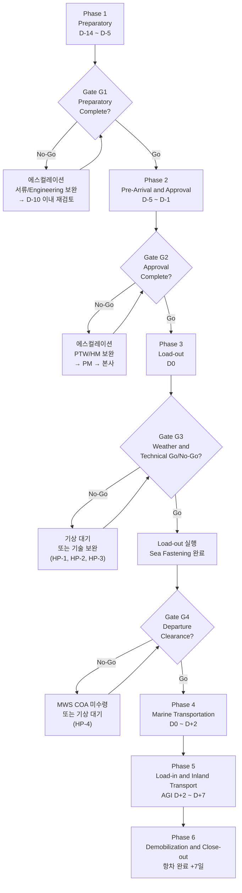
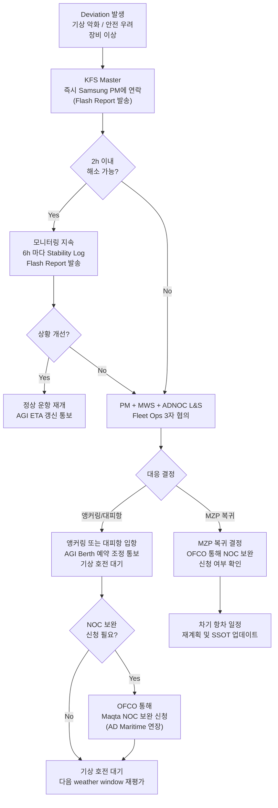
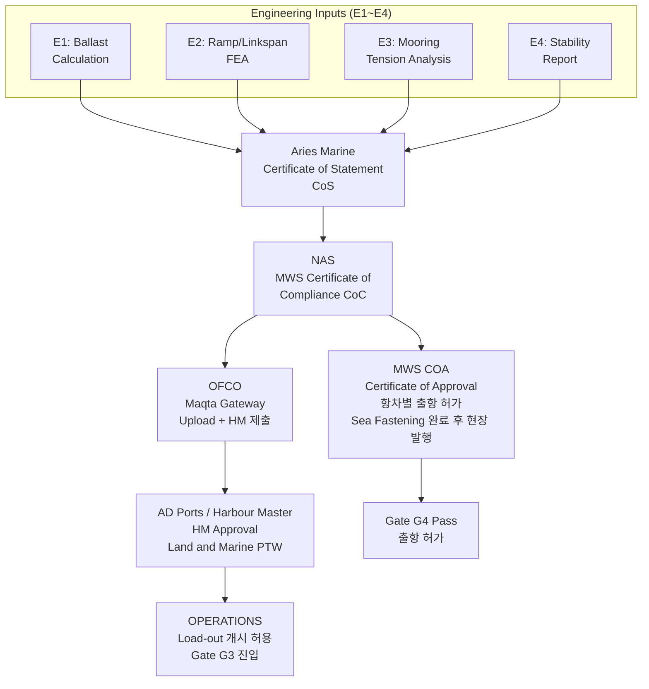
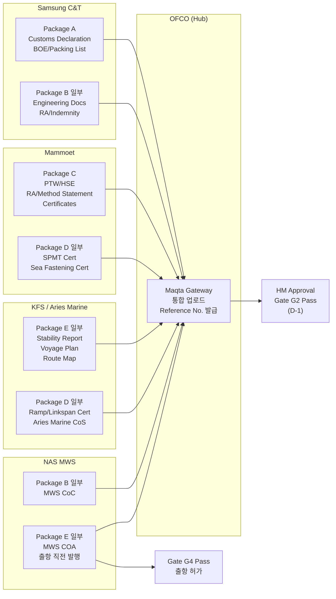
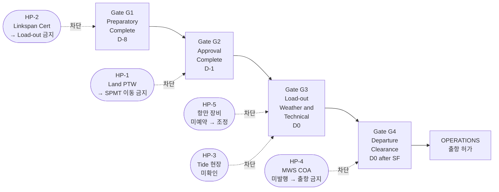
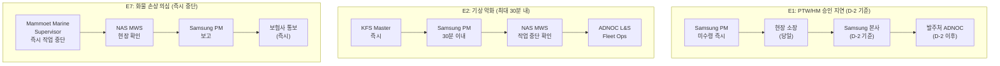
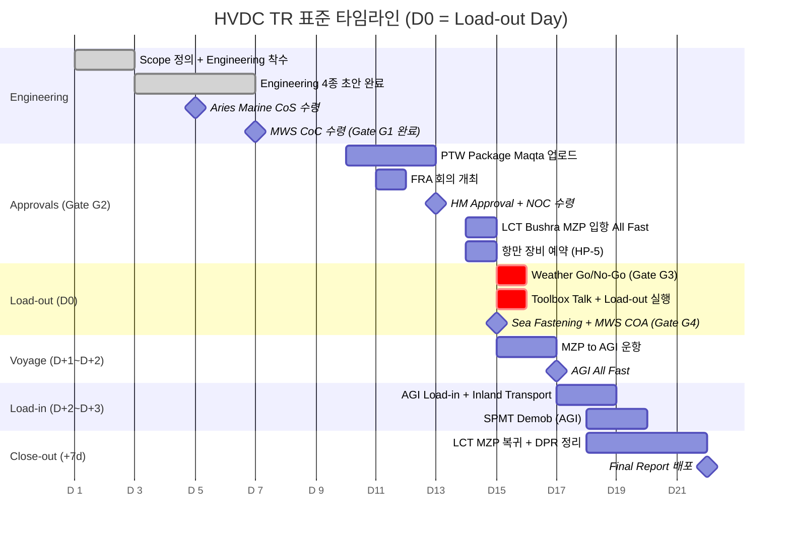
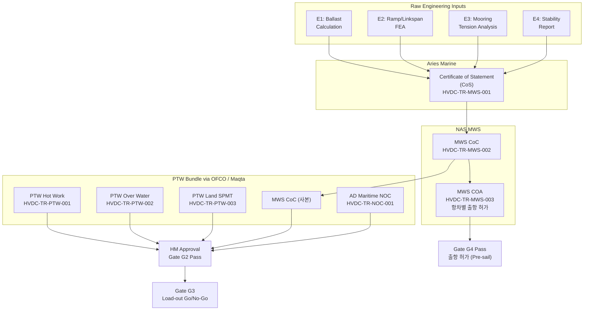

# HVDC TR 표준 운영 가이드 (Standard Operating Guide)

**Document ID:** HVDC-TR-SOG-001  
**Version:** Draft v1.0  
**Date:** 2026-03-29  
**Authoritative Source:** 내부 검토 후 "Issued for Use" 시 본 버전 폐기 및 v1.1 발행  
**Distribution:** Internal — Project PM, Marine Superintendent, HSE, Port Agency (OFCO), SPMT Lead  
**PII 주의:** 이 문서는 스레드에서 추출한 절차/사실만 포함하며, 개인 연락처는 문서 레지스트리 내부용에만 관리한다.

---

## 변경 이력 (Change Log)

| Rev | Date | Author | Description |
|-----|------|--------|-------------|
| Draft v1.0 | 2026-03-29 | (작성자) | 초안 — 프로젝트 실적 기반 작성 (docs/일정 + email_threads 기반) |
| Draft v1.0 rev1 | 2026-03-29 | (작성자) | Mermaid 다이어그램 8종 삽입 (D1~D8) + 상세 내용 보충 7종 (X1~X7): Engineering Package 최소 구성, Maqta 업로드 절차, Sea Fastening 점검표, SPMT 재구성 기준표, 리스크 R11~R15 추가, Cycle 7.00d 산출 근거, 신규 인력 On-site Orientation 체크리스트 |
| Draft v1.0 rev2 | 2026-03-29 | (작성자) | TBD 해소: 지연 비용 참고치 (~USD 20,000/day) 근거 명기 + Appendix F 외부 참조 링크 10건 추가 (Maqta Gateway, AD Ports, DMT, IMO SOLAS, CSS Code, IMO MSC.1/Circ.1353, FANR, NCEMA, NCM UAE, ADNOC L&S) |

---

## 목차

1. Executive Summary
2. 용어집 (Glossary)
3. End-to-End 프로세스 (SOP)
   - [D1] End-to-End 전체 흐름도 (Gate 포함)
   - Phase 1: Preparatory (D-14 ~ D-5) — [X1] Engineering Package 최소 구성
   - Phase 2: Pre-Arrival and Approval (D-5 ~ D-1) — [X2] Maqta 업로드 절차
   - Phase 3: Load-out (MZP RoRo Operation) — [X3] Sea Fastening 점검표
   - Phase 4: Marine Transportation (MZP to AGI) — [D5] Deviation 의사결정 흐름도
   - Phase 5: Load-in and Inland Transport (AGI) — [X4] SPMT 재구성 기준표
   - Phase 6: Demobilization and Close-out
4. 필수 문서 체계
   - 4.1 Mandatory Documents (Land + Marine PTW)
   - 4.2 Engineering Documents
   - 4.3 MWS 승인 플로우 — [D2] MWS 승인 체인 흐름도
   - 4.4 제출 Package A~E (항차별 통합 제출 구조) — [D3] Package 조직별 흐름도
5. Critical Control Points (Go/No-Go Gates)
   - [D4] Gate G1~G4 진행 흐름 및 Hold Point 연결도
   - Hold Points (전 항차 공통)
6. 리스크 레지스터 — [X5] R11~R15 추가
7. RACI 매트릭스
   - 7.1 에스컬레이션 매트릭스 — [D6] 주요 에스컬레이션 체인 흐름도
8. 표준 타임라인
   - 8.1 관리 타겟 (D-day 기준) — [D7] Gantt 차트
   - 8.2 실적 기반 참고 (TR1~TR3) — [X6] Cycle 7.00d 산출 근거
9. 신규 인력 체크리스트
   - 최초 현장 투입 시 (First Day On-site) — [X7]
   - Load-out 전 24h / 4h / 1h
   - AGI Load-in 전 24h / 4h
10. Lessons Learned
11. 결론
12. 부록: 문서 레지스트리 / 일정 및 커뮤니케이션 근거 추출표
    - A. 문서 레지스트리 — [D8] 문서 의존성 그래프
    - B. 일정 및 커뮤니케이션 근거 추출표
    - C. Scope Confirmation Letter 템플릿
    - D. Pre-Operation Meeting Agenda 템플릿
    - E. Daily Progress Report (DPR) 템플릿
    - F. 외부 참조 링크 (External Regulatory & Port References)

---

## 1. Executive Summary

본 문서는 HVDC 변압기(TR Unit, 217 ton/unit)의 **Mina Zayed Port(MZP) → Al Ghallan Island(AGI)** 구간 운송 전 과정을 표준화한 운영 가이드이다. 총 7 Trip, TR Unit 1대/Trip, LCT Bushra(RoRo) + SPMT 방식으로 수행된다.

**Scope In / Out (책임 경계 요약):**

| 항목 | 담당 조직 | 비고 |
|------|-----------|------|
| Ballast pump 제공 | LCT 선주(KFS/Bushra) — 또는 별도 협의 | Load-out 전 Scope 서면 확정 필수 (Lesson 1 참조) |
| Mooring lines | LCT 선주(KFS) | ADNOC L&S / Harbour Master 요건 충족 |
| Ramp/Linkspan 공급 | Mammoet | 별도 인증 필요 (Aries Marine) |
| SPMT 운전 | Mammoet | 자체 장비 + 인증 일체 |
| PTW/NOC 제출 | OFCO (Port Agency) | Samsung 대리 Maqta Gateway 업로드 |
| MWS | Nouri Alwan Marine Surveyors (NAS) | Harbour Master 제출 |

**Top 3 성공 요건:**
1. Engineering 선행 확보 (Ballast / Ramp FEA / Mooring): MWS 승인의 전제 조건.
2. Document Gate 통과 (PTW + HM Approval + MWS): 전체 작업 중단의 근본 원인이 되므로 D-10 이전 착수.
3. 현장 Control (Weather window / Draft & Trim / Safety): 기상 악화 및 Berth 점유 시 즉시 에스컬레이션.

**Top 3 실패 요인 (프로젝트 실적 기반):**
1. Linkspan 인증 미확보 → Load-out 보류 (TR1, 내부 교훈).
2. Ballast/Mooring Scope 불명확 → 엔지니어링 지연 (TR1, 내부 교훈).
3. 기상(Fog, 강풍) 및 Berth 점유 → TR2(+2d), TR3(+2~3d) 지연 (실적 근거: AGI_TR_일정_최종보고서_FINAL.MD, Mammoet_DPR_Verification_v4_최종보고서.md).

---

## 2. 용어집 (Glossary)

| 용어 | 정의 |
|------|------|
| **AGI** | Al Ghallan Island — TR 최종 설치 현장 |
| **ADNOC L&S** | ADNOC Logistics & Services — AGI 현장 관리 및 Fleet Operations 조율 담당. |
| **All Fast** | 선박이 완전히 계류되고 작업 가능 상태. Gangway down & secured 포함. (출처: AmSty Marine Terminal Berthing Requirements) |
| **Aries Marine** | 제3자 Marine Engineering 컨설팅사. Ramp FEA, Ballast Calc, Mooring Analysis, Certificate of Statement 수행. 본 프로젝트 MWS 제출 패키지 핵심 작성자. |
| **Cast Off** | 계류줄 해제 후 출항 시점 (Departure). |
| **COA** | Certificate of Approval — MWS(NAS)가 항차별로 발행하는 출항 허가 인증서. 공학 검토 기반의 MWS CoC와 별개로, 매 항차 Sea Fastening 완료 후 현장 검사를 통해 발행. Hold Point HP-4: COA 없이 출항 금지. |
| **DAS** | Das Island — 별도 운항 노선; 본 가이드 범위 밖 |
| **DSV** | Dive Support Vessel — AGI 구역 해저 작업 지원 선박. ADNOC L&S 운용. HVDC TR 운송과 직접 관련 없으나 AGI Berth 공유 시 일정 조율 필요. |
| **Draft/Trim** | 선박 흘수 (전후 차 = Trim). RoRo 작업 시 Ramp 각도에 직결됨. |
| **FOS** | Factor of Safety — 허용하중 대비 실 하중 비율. Aries Marine 계산 기준 FOS ~8% 여유. |
| **FRA** | Formal Risk Assessment (또는 HSE review). AD Ports에서 요구하는 사전 리스크 평가 회의. |
| **GBP** | Ground Bearing Pressure (바닥 지지력, t/m²). Mammoet SPMT 기준 4.93 t/m² (내부 실적). |
| **GM** | 선박 횡안정성 지표 (Metacentric Height). 양수 유지 필수. |
| **HM** | Harbour Master — Mina Zayed Port 항만장. 최종 작업 승인권자. |
| **Hot Work PTW** | 용접/화기 작업 허가서. Maqta Gateway 통해 Voyage별 신청. |
| **KFS** | Khalid Faraj Shipping — LCT Bushra 선주. |
| **Linkspan / Ramp** | LCT 선수(bow)에 부착된 경사형 교량. SPMT가 이 위를 통해 TR을 선적. 별도 강도 인증 필요. |
| **LCT** | Landing Craft Tank — TR 운반 선박 (LCT Bushra). |
| **Maqta Gateway** | Abu Dhabi Ports 포털. 모든 PTW/NOC/서류는 이곳에 업로드. |
| **MMT / Mammoet** | Mammoet — SPMT Load-out 전문 기업. |
| **MWS** | Marine Warranty Surveyor — 해상 작업의 안전·공학적 적합성을 제3자 인증. 본 프로젝트: Nouri Alwan Marine Surveyors (NAS). |
| **MZP** | Mina Zayed Port — 출발항. |
| **NOC** | No Objection Certificate — AD Maritime에서 AGI 운항 전 필요. |
| **OFCO** | O.F.C.O. — Port Agency. PTW/NOC 제출 창구. |
| **PTW** | Permit to Work. 유형: (1) Hot Work, (2) Working Over Water, (3) Land Oversized & Heavy Load (SPMT). |
| **RoRo** | Roll-on / Roll-off — SPMT로 TR을 Ramp 통해 선적/하역하는 방식. |
| **SPMT** | Self-Propelled Modular Transporter — Mammoet 운용 다축 자주식 대형 화물 운반차. |
| **VIP Escalation** | 내부 교훈: 승인 지연 시 최소 24h 이전 PM → Superintendent → 발주처 순으로 에스컬레이션. |

---

## 3. End-to-End 프로세스 (SOP)

각 Phase는 **목적 / 전제 / 단계별 활동 / 담당 / 산출물 / 게이트** 블록으로 기술한다.

**[D1] End-to-End 전체 흐름도 (Gate 포함)**



---

### Phase 1: Preparatory (D-14 ~ D-5)

**목적:** 다음 항차 수행에 필요한 Engineering, Scope 정의, 계약 확인을 완료한다.

**전제:**
- 이전 항차 Close-out 완료 (또는 병렬 진행 시 Scope 충돌 없음 확인).
- TR Unit 현장 준비 완료 (Yard 내 대기 위치, 장비 접근 가능).

**단계별 활동:**

| 순번 | 활동 | 담당 | 기간 목표 |
|------|------|------|-----------|
| 1.1 | Scope 정의 확인: Ballast pump / Mooring line / Ramp 책임 서면 확정 | Samsung PM + KFS + Mammoet | D-14 |
| 1.2 | Vessel Data 수령: GA Drawing, Stability Book, Ramp/Deck 도면 | KFS → Samsung | D-14 |
| 1.3 | Engineering 수행: Ballast Calculation (하중 기반) | Aries Marine (제3자) 또는 지정 Marine Engineer | D-12 |
| 1.4 | Engineering 수행: Ramp/Linkspan FEA (강도 계산) | Aries Marine | D-12 |
| 1.5 | Engineering 수행: Mooring Tension Analysis | Aries Marine / KFS | D-12 |
| 1.6 | Engineering 수행: Stability Report | KFS Master + Marine Engineer | D-11 |
| 1.7 | Aries Marine에 계산 근거 Package 전달 (Ramp Report + MMT 계산 + Design Drawing) | Samsung → Aries Marine | D-12 |

**[X1] Aries Marine 전달 Package 최소 구성**

아래 자료가 D-12까지 Aries Marine에 전달되지 않으면 CoS 발행이 지연된다.

| 항목 | 제공자 | 형식 | 비고 |
|------|--------|------|------|
| TR Unit 중량 + CoG 좌표 (X/Y/Z) | Samsung Engineering | PDF/Excel | 중량 배분표 포함. 217 ton/unit 기준 |
| LCT Deck Layout Drawing (Ramp 위치 포함) | KFS | DWG/PDF | Deck 강도 허용치 표기 필수 |
| SPMT Axle 구성 시트 (MZP/AGI 각각) | Mammoet | PDF | Axle 수, 간격, 접지압(GBP: ~4.93 t/m²) 계산 포함 |
| Ramp/Linkspan 구조 도면 및 기존 FEA (있을 시) | Mammoet + KFS | PDF | 이전 항차 승인 보고서 재활용 가능 여부 NAS 확인 필요 |
| 예상 Tide Range (Load-out Day ±6h) | KFS / Samsung | PDF | tide-forecast.com 또는 ADNOC 공식 조석표 기준 |
| 운항 경로 (MZP→AGI, 수심/장애물 표기) | KFS | PDF | NOC Route Map과 동일 문서 사용 가능 |
| 1.8 | Aries Marine Certificate of Statement (CoC) 수령 | Aries Marine → Samsung | D-10 |
| 1.9 | CoC + Full Engineering Package를 MWS(NAS)에 제출 | Samsung → NAS | D-10 |
| 1.10 | MWS Certificate of Compliance 수령 | NAS → Samsung | D-8 |
| 1.11 | SPMT 동원 계획 수립 (Axle 수, 이동 경로, Gate Pass 신청) | Mammoet | D-12 |

**게이트 G1 (Preparatory Complete):**
- Prerequisite: Engineering Package 4종(Ballast/FEA/Mooring/Stability) 완성.
- Deliverable: Aries Marine CoC + MWS CoC.
- Approver: Samsung PM.
- 실패 시 조치: D-10 이내 미완료 → PM 에스컬레이션, D-7 이내 미완료 → HM 승인 불가 리스크 전파.

---

### Phase 2: Pre-Arrival and Approval (D-5 ~ D-1)

**목적:** Port (MZP), AD Maritime (NOC), Harbour Master (HM) 승인을 모두 확보한다. 이 Phase 완료 전 어떠한 화물 이동 또는 선박 안벽 접안도 허용되지 않는다.

**전제:**
- Phase 1 Gate G1 통과.
- LCT Bushra ETA 확정 (Port Authority에 최소 3일 전 통지).
- RoRo Berth 가용 여부 사전 확인 (OFCO 통해 AD Ports에 사전 요청 — "RoRo Berth is subject to availability").

**단계별 활동:**

| 순번 | 활동 | 담당 | 기간 목표 |
|------|------|------|-----------|
| 2.1 | Pre-Arrival Cargo Declaration 제출 (BOE, Packing List 포함) | Samsung → OFCO | D-5 |
| 2.2 | Maqta Gateway 업로드 — PTW Package 3종: (1) Hot Work, (2) Working Over Water, (3) Land Oversized & Heavy Load (SPMT) | OFCO (Samsung 대리) | D-5 |

**[X2] Maqta Gateway 업로드 실무 절차**

1. OFCO 담당자가 AD Ports 통합 포털(Maqta Gateway) 로그인 → 해당 Vessel/Voyage 선택.
2. PTW 유형별 신청서 양식 선택: **(a) Hot Work, (b) Working Over Water, (c) Land Oversized & Heavy Load**. 각 유형은 별개 신청 건으로 처리된다.
3. 각 PTW 유형에 맞는 서류(섹션 4.1.1 참조) PDF 첨부. **주의: AD Ports 지정 양식 버전 불일치 시 자동 반려** → OFCO 통해 최신 양식 버전을 D-7 이전 확인한다.
4. 제출 완료 후 **Reference No. 화면 캡처 보관** → Samsung PM에 즉시 전달 (체크리스트 섹션 9 항목과 대조).
5. 승인 여부 확인: 통상 **2~3 영업일**. 주말 포함 시 +1~2일 추가. **금요일 오전 제출 = 다음주 화요일 이후** 예상 → D-5 버퍼 계획 필수.
6. 반려 시: 반려 사유 OFCO 통해 확인 → 수정 재제출 (처리 시간 리셋). 반려 주요 원인: 양식 버전 오류, 서명 누락, 유효기간 만료 인증서 첨부.
| 2.3 | PTW Package 구성 확인 (최소 14종 문서 — 섹션 4.1 참조) | Samsung PM + OFCO | D-5 |
| 2.4 | MWS CoC + Engineering Package → HM 제출 (via OFCO) | Samsung → OFCO → HM | D-5 |
| 2.5 | FRA (Formal Risk Assessment) 회의 개최 (AD Ports HSE 참석) | Samsung + OFCO + Mammoet + AD Ports HSE | D-4 |
| 2.6 | AD Maritime NOC 신청 (AGI 입항 허가) — 필요 서류 6종 (섹션 4.1 참조) | OFCO | D-4 |
| 2.7 | HM 승인 / Land PTW 승인 수령 확인 | OFCO → Samsung | D-2 |
| 2.8 | AD Maritime NOC 수령 확인 | OFCO → Samsung | D-2 |
| 2.9 | LCT Bushra 입항 (MZP RoRo Berth All Fast) | KFS | D-1 |
| 2.10 | Pre-Operation Meeting (Samsung + Mammoet + KFS + OFCO + ADNOC L&S) | Samsung PM | D-1 |
| 2.11 | MZP 항만 장비 예약 (MZ GC Ops via OFCO): Crane ≥ 25 t × 1, Forklift 10 t × 2, Forklift 5 t × 1, Gang × 1, Mafi Trailer (필요 시). **요청 시한: Load-out Day 기준 최소 24h 전** (Hold Point HP-5) | OFCO → MZ GC Ops (Mammoet 수량 확인) | D-1 (최소 24h 전) |

**주요 주의사항 (프로젝트 교훈 기반):**
- PTW는 **Voyage별 신청**이다. 월 단위 유효기간 신청 불가 (내부 교훈: OFCO 서신 2026-01-15 기준).
- Land PTW(SPMT) 처리 소요 시간: 주말 포함 **최소 2~3 영업일**. Weekend를 포함한 여유 일정 필수.
- HM은 Linkspan/Ramp 인증 없이 작업 불허한다. 인증 미확보 시 즉시 중단 (내부 교훈: 2026-01-28 스레드).

**게이트 G2 (Pre-Arrival Approval Complete):**
- Prerequisite: PTW 3종 Approved + HM Approval + AD Maritime NOC.
- Deliverable: PTW Reference Numbers + Approval Letters.
- Approver: HM (Harbour Master) + AD Ports HSE.
- 실패 시 조치: 미승인 시 어떠한 이동/Roll-on도 금지. 즉시 PM → Samsung 본부 에스컬레이션.

---

### Phase 3: Load-out (MZP RoRo Operation) (D0)

**목적:** SPMT를 이용해 TR Unit 1기를 LCT Bushra에 Roll-on하고 Sea Fastening을 완료한다.

**전제:**
- Gate G2 통과 (PTW/HM 모두 승인 완료).
- 기상 Go/No-Go 확인 (Gate G3 참조).
- Tide window 확인: SPMT-Ramp-LCT Deck 레벨 정합 시간대 특정 (Ballast 계획과 연동).
- Toolbox Talk 완료, PPE 착용 확인.

**단계별 활동:**

| 순번 | 활동 | 담당 |
|------|------|------|
| 3.0a | **[Berth Day 1] Beam Change:** 이전 항차 고정 Beam 제거 및 차기 TR용 Beam 교체 | Mammoet |
| 3.0b | **[Berth Day 1] Deck Stool 제거 + FW 보급:** Offloading 보조 구조물(Stool) 제거, 신선수(Fresh Water) 보급 완료 확인 | Mammoet + KFS |
| 3.1 | SPMT 동원 및 기능 테스트 (유압, 조향, 하중 분산) | Mammoet |
| 3.2 | Linkspan/Ramp LCT Bow에 거치, Alignment 측정 (각도 목표: 최소화, 실제 ≈ 0° 또는 완만한 경사). 서명: MWS 입회 | Mammoet + KFS + NAS(MWS) |
| 3.3 | Ramp Alignment 실측값 MWS에 보고 및 승인 | NAS → Mammoet |
| 3.4 | LCT Ballasting 개시 (Ramp 각도 유지 목적) | KFS(선장) + Marine Engineer |
| 3.5 | Toolbox Talk (All hands) — Hot Work 포함 | Samsung HSE + Mammoet HSE |
| 3.6 | SPMT TR Unit Pick-up, Yard → Ramp 이동 | Mammoet |
| 3.7 | TR Unit Ramp 통과 → LCT Deck Roll-on | Mammoet + Samsung |
| 3.8 | SPMT 하강 및 TR Unit Deck에 정착 확인 | Mammoet |
| 3.9 | Sea Fastening (D-Ring, Lashing, Wedge, Steel Pad 등) 수행 | Mammoet |

**[X3] Sea Fastening 구성 부품 점검표 (MWS 서명 전 확인)**

*(수량·규격은 항차별 Stowage Plan 및 MWS 승인 기준. 아래는 점검 카테고리 안내용이다.)*

| 부품 | 수량 기준 | 규격 | 점검 항목 | 담당 |
|------|----------|------|----------|------|
| D-Ring (Deck 용접형) | MWS 승인 Stowage Plan 기준 | 허용 하중 NAS 확인값 이상 | 용접 상태, 균열·부식 없음 | Mammoet + NAS |
| Chain Lashing | 4세트 이상 | Grade 80 이상, 각 체인 SWL 태그 부착 | 장력 균등, 마모·결손 없음, 클립 방향 확인 | Mammoet |
| Wedge / Steel Stool | TR 하중 분산 계획 기반 | Mammoet Engineering 계획 사양 | 접지 면적 확보, 슬립 방지재 설치 여부 | Mammoet |
| Steel Pad (Deck 보호) | TR 접촉 면적 기준 | Mammoet Engineering 계획 | 위치 정확성, 두께 균일성 | Mammoet |
| Turnbuckle / Shackle | 4개 이상 | MWS 승인 SWL 사양 | SWL 태그 확인, 핀 결손 없음, 잠금 와이어 체결 | Mammoet |
| Hinge 연결부 | 해당 시 | Mammoet 설계 기준 | 체결 토크 확인, 핀 탈락 없음 | Mammoet |
| 3.10 | Sea Fastening 검사 + MWS 최종 확인 서명 | NAS (MWS) |
| 3.11 | LCT Sailing Draft/GM 최종 확인 | KFS Master |
| 3.12 | Deck Clearance → LCT 출항 준비 | KFS Master |

**운영 한계 기준 (작업 중단 기준):**

| 기준 | 한계값 | 출처 |
|------|--------|------|
| 풍속 | > 15 kt (가이드라인). 현장 여건에 따라 조정 가능, 단 MWS/Master 서면 동의 필요 | 내부 운영 가이드라인 |
| 시정 | Fog/Fog Patches, Vis < 1,000 m → 작업 중단 | WhatsApp 실적 (2026-02-11), TR2 교훈 |
| 작업 시간 | Daylight Operation 원칙 (일몰 후 작업 시 별도 PTW/HM 확인 필요) | 내부 운영 원칙 |
| Ramp 각도 | 급경사 허용 불가. 최대 경사각은 Aries Marine 계산값 이내 | Aries Marine FEA 출처 |

**게이트 G3 (Load-out Weather & Technical Go/No-Go):**

| 항목 | OK 조건 | STOP 조건 |
|------|---------|-----------|
| 풍속 | <= 15 kt | > 15 kt |
| 시정 | > 1,000 m | Fog / Fog Patches |
| Ramp Angle | MWS 승인 범위 내 | MWS 미승인 |
| LCT GM | 양수 유지 | 음수 |
| PTW 유효기간 | 현재 유효 | 만료 |
| HM Approval | 유효 | 미승인 / 만료 |

- Deliverable: Sea Fastening Cert (MWS 서명) + LCT Departure Checklist.
- Approver: Samsung PM + MWS + KFS Master.
- 실패 시 조치: 기상/기술 STOP → 즉시 작업 중단, MWS 및 PM에 사유 서면 보고.

---

### Phase 4: Marine Transportation (MZP to AGI) (D0 ~ D+1 ~ D+2)

**목적:** LCT Bushra가 MZP에서 AGI까지 안전하게 운항하고 AGI Berth에 안전 계류한다.

**전제:**
- Sea Fastening Cert 확보.
- AD Maritime NOC 유효.
- Weather window 확인 (출항 결정 시 NCM Al Bahar / tide-forecast.com / METAR(OMAA) 기준 종합 판단).
- AGI Berth 가용 여부 사전 확인.

**단계별 활동:**

| 순번 | 활동 | 담당 |
|------|------|------|
| 4.1 | LCT 출항 (MZP Cast Off) — 시간 기록 필수 | KFS Master |
| 4.2 | 운항 중 매 6시간 Stability 점검 (Log 기록) | KFS Master + Engineer |
| 4.3 | 매일 Progress Report 발송: 위치, 안정성, 기상, 이상 사항 | KFS Master → Samsung PM → 프로젝트 배포 |
| 4.4 | AGI 접근 시 Pilot 요청 (해당 시) + Berth 입항 통보 | KFS Master + OFCO |
| 4.5 | AGI Berth All Fast — 시간 기록 | KFS Master |
| 4.6 | Mooring Verification (Mooring Plan 대비 실측 장력 확인) | NAS(MWS) 입회 또는 Samsung Marine Rep |

**일일 보고 항목 (Daily Report 최소 포함 사항):**
- 현재 위치 (좌표 또는 항적 캡처)
- LCT 상태 (Draft FWD/AFT, GM, Trim)
- 기상 현황 (풍속/풍향, 파고, 시정)
- 이상 사항 또는 Deviation (있을 경우 즉시 별도 Flash Report 발송)
- 예상 AGI ETA

**Deviation 시 의사결정 트리:**
1. 기상 악화 또는 안전 우려 발생 → KFS Master 즉시 Samsung PM에 연락.
2. PM + MWS + ADNOC L&S Fleet Ops 협의 → 대피항 또는 앵커링 결정.
3. 2h 이내 해소 전망 없을 시 → AGI Berth 예약 조정 통보.
4. 복귀 또는 대기 결정 → Maqta에 NOC 보완 신청 여부 OFCO 확인.

**[D5] Deviation 의사결정 흐름도**



---

### Phase 5: Load-in and Inland Transport (AGI) (D+2 ~ D+7)

**목적:** AGI에서 TR Unit을 LCT에서 하역하고 지정 Laydown Yard까지 이송한다.

**전제:**
- AGI All Fast 완료.
- AGI 구역 내 PTW 별도 취득 여부 확인 (FRA 수행 여부 AGI 관할 기관과 사전 협의).
- SPMT 재구성 사전 계획 (MZP에서 사용한 축 수와 AGI에서의 사용 축 수가 다를 경우 재구성 시간 반영).

**단계별 활동:**

| 순번 | 활동 | 담당 |
|------|------|------|
| 5.1 | Mooring Verification 완료 확인 | NAS(MWS) + KFS |
| 5.2 | Lashing Removal (Sea Fastening 해체) | Mammoet |
| 5.3 | Steel Wedge, D-Ring, Hinge 등 부속물 제거 및 목록 확인 | Mammoet |
| 5.4 | SPMT 재구성 (필요 시, 예: 14 axle → 10 axle) — 구성 변경 기준은 Mammoet Engineering 계획에 따름 | Mammoet |

**[X4] SPMT 재구성 기준표 (MZP vs AGI)**

*(Axle 수는 Mammoet Engineering 계획 기준. 표의 수치는 TR1 실적 기반 예시이며 각 항차 재확인 필수.)*

| 구분 | MZP 구성 (예시) | AGI 구성 (예시) | 재구성 소요 시간 | Engineering 승인 |
|------|---------------|---------------|----------------|-----------------|
| Axle 수 | 14 axle | 10 axle | 약 2~4h | Mammoet Engineering 검토 및 PM 서명 필수 |
| 편성 폭 | TR 폭 기준 (여유 있는 MZP Yard) | AGI Jetty 폭 제한에 맞춤 | 포함 | 포함 |
| 재구성 위치 | AGI Berth 인접 공간 | - | - | AGI 관할 기관 허가 필요 시 별도 FRA 수행 |
| 재구성 조건 | MZP 대형 야드 활용 | AGI Jetty/이동 경로 폭 제약 | - | - |
| GBP 재계산 | MZP Yard 지지력 기준 | AGI Jetty 하중 한계 재확인 | - | Samsung Engineer 확인 필요 |
| 5.5 | Ramp/Linkspan 거치 및 Alignment 확인 (AGI 측) | Mammoet + KFS |
| 5.6 | TR Unit Roll-off (LCT Deck → Ramp → AGI Jetty) | Mammoet |
| 5.7 | Jetty → Laydown Yard 이동 (허가 경로, 교통 통제 포함) | Mammoet + Samsung + 현장 Traffic Controller |
| 5.8 | Laydown Yard 거치 확인 (위치, 지지 조건, 하중 분산 확인) | Samsung Engineer + Mammoet |
| 5.9 | LCT 출항 준비 및 MZP 복귀 또는 다음 항차 대기 | KFS Master |

**참고 (실적 기반):**
- TR1: AGI 하역 작업 약 2026-02-04 ~ 2026-02-08 (4일 소요, FRA 승인/운송 허가 지연 +3d 발생. 내부 교훈).
- TR2 Load-in: 2026-02-13 14:30 (Planned 02-12 대비 +1d. 출항 지연 연쇄 영향).
- TR3 Load-in: 2026-02-19 (계획 대비 ±0d).
  (출처: Mammoet_DPR_Verification_v4_최종보고서.md)

---

### Phase 6: Demobilization and Close-out (항차 완료 후 7일)

**목적:** 장비 회수, 문서 마감, Final Report 배포로 해당 항차를 공식 종료한다.

**전제:**
- TR Unit Laydown Yard 거치 완료.
- LCT 복귀 확인 (또는 다음 항차 위한 MZP 입항 확인).

**단계별 활동:**

| 순번 | 활동 | 담당 | 기한 |
|------|------|------|------|
| 6.1 | SPMT Demob (AGI 구역 장비 철수) | Mammoet | 항차 완료 +2일 |
| 6.2 | Linkspan/Ramp 회수 및 LCT 적재 | Mammoet + KFS | 항차 완료 +2일 |
| 6.3 | LCT MZP 복귀 (다음 항차 준비, TR7 이후는 최종 Demob) | KFS | 항차 완료 +3일 |
| 6.4 | 이상 보고서 취합 (NCR, Near Miss, 기상 일지) | Samsung HSE | 항차 완료 +3일 |
| 6.5 | DPR (Daily Progress Report) 데이터 최종 정리 | Samsung PM + Mammoet | 항차 완료 +5일 |
| 6.6 | Final Report 초안 작성: 마일스톤 실적, 지연 원인, 증빙 인덱스 | Samsung PM | 항차 완료 +7일 |
| 6.7 | Final Report 배포 (내부 배포, 발주처 포함) | Samsung PM | 항차 완료 +7일 |
| 6.8 | 차기 항차 Kickoff (Preparatory Phase 시작) | Samsung PM | 필요 시 즉시 |

---

## 4. 필수 문서 체계

### 4.1 Mandatory Documents

아래 표는 MZP 작업 허가(PTW) 패키지 및 AGI NOC에 필요한 문서 목록이다. 제출 누락 시 HM 승인이 차단된다.
(출처: OFCO 서신 2026-01-15, Samsung 요약 메일 2026-01-21)

#### 4.1.1 Land + Marine PTW Package (Maqta Gateway 업로드)

| No | 문서명 | 담당 (제출자) | 제출 기한 | 포맷 | 비고 |
|----|--------|---------------|-----------|------|------|
| 1 | Risk Assessment (AD Port Format) | Mammoet | D-5 | PDF | AD Ports 지정 양식 사용 |
| 2 | PTW Applicant/Receiver Consent Form | Mammoet | D-5 | PDF | 서명 필요 |
| 3 | PTW Application - Land Oversized & Heavy Load (SPMT) | Mammoet | D-5 | PDF | 처리 2~3 영업일 소요 |
| 4 | Stowage Plan | Mammoet | D-5 | PDF | - |
| 5 | Critical Lifting Plan | Mammoet | D-5 | PDF | - |
| 6 | Method Statement (incl. Weather Criteria) | Mammoet | D-5 | PDF | AD Ports 지정 양식 |
| 7 | 3rd Party Equipment Certificates (SPMT, Operators) | Mammoet | D-5 | PDF | 유효기간 확인 필수 |
| 8 | Lashing Plan | Mammoet | D-5 | PDF | - |
| 9 | Firewatcher Certificate | Mammoet | D-5 | PDF | Hot Work PTW 필수 첨부 |
| 10 | Ramp Plate Certificate (Linkspan 강도 인증) | Mammoet / Aries Marine | D-7 | PDF | **HM 요건. 미확보 시 즉시 중단** |
| 11 | Mooring Plan | KFS (LCT Bushra) | D-5 | PDF | - |
| 12 | Voyage Plan (MZP to AGI) | KFS / Aries Marine | D-5 | PDF | - |
| 13 | Route Map | KFS / Aries Marine | D-5 | PDF | - |
| 14 | Stability Calculation | KFS Master + Marine Engineer | D-7 | PDF | - |
| 15 | Marine Warranty Survey (MWS) Certificate | NAS (Nouri Alwan Marine Surveyors) | D-5 | PDF | **HM 제출 필수** |
| 16 | PTW - Hot Work | Mammoet/Samsung via OFCO | D-5 | PDF | Voyage별 신청 (월 단위 불가) |
| 17 | PTW - Working Over Water | Mammoet/Samsung via OFCO | D-5 | PDF | Voyage별 신청 |
| 18 | MWS COA (Certificate of Approval, 항차별 출항 허가) | NAS (Nouri Alwan Marine Surveyors) | Pre-sail (Sea Fastening 완료 후) | PDF | **출항 금지 Hard Stop. CoC와 별개로 항차별 현장 검사 후 발행** |

#### 4.1.2 Samsung 제출 서류

| No | 문서명 | 기한 |
|----|--------|------|
| S1 | Countdown Plan | D-5 |
| S2 | Undertaking Letter | D-5 |
| S3 | Indemnity Letter (General) | D-5 |
| S4 | Indemnity Letter (Lifting Plan) | D-5 |
| S5 | Local Trading License | D-5 |
| S6 | Contract Award Letter Copy | D-5 |
| S7 | Detailed Risk Assessment & Emergency Response Plan | D-5 |

#### 4.1.3 AD Maritime NOC (AGI 운항 허가)

| No | 문서명 | 담당 |
|----|--------|------|
| N1 | Local Trading License | Samsung |
| N2 | Detailed RA & Emergency Response Plan | Samsung + Mammoet |
| N3 | No Objection from relevant Authorities | OFCO 조율 |
| N4 | Voyage Plan | KFS |
| N5 | Route Map | KFS |
| N6 | Contract Award Letter Copy | Samsung |

---

### 4.2 Engineering Documents (Critical — MWS 승인 전제)

| No | 문서명 | 작성자 | MWS 연결 여부 | 비고 |
|----|--------|--------|---------------|------|
| E1 | Ballast Calculation Report | Marine Engineer / Aries Marine | 필수 (Ballast 승인 근거) | Scope 확정 후 착수 (Lesson 1) |
| E2 | Ramp/Linkspan FEA (Strength Check) | Aries Marine | 필수 (Ramp Cert 근거) | FOS 확인 (실적: ~8% 여유, 내부 수치) |
| E3 | Mooring Tension Analysis | Aries Marine / KFS | 필수 (Mooring Plan 근거) | Corner Jetty 요건과 연동 |
| E4 | Stability Report | KFS Master + Marine Engineer | 필수 (Stability Calculation = 문서 14) | - |
| E5 | Certificate of Statement (Aries Marine) | Aries Marine | MWS CoC의 입력 | CoS + E2 + E1 Package → MWS 제출 |
| E6 | MWS COA (Certificate of Approval) | NAS | **필수 (출항 전 최종 Gate)** | CoC(E1~E4 검토) 기반 + 항차별 Sea Fastening 현장 확인 후 발행. Gate G4 Hard Stop |

---

### 4.3 MWS 승인 플로우

다음 다이어그램은 Engineering에서 HM 작업 승인까지의 단방향 흐름을 나타낸다.

**[D2] MWS 승인 체인 흐름도**



*(참고용 ASCII 흐름 — 상세 설명은 위 다이어그램 참조)*

```
[Samsung/Mammoet/KFS]
  |
  |--(E1) Ballast Calc
  |--(E2) Ramp FEA
  |--(E3) Mooring Analysis
  |--(E4) Stability Report
  |
  v
[Aries Marine]
  Certificate of Statement (CoS)
  |
  +-- (CoS + E2 + Design Drawing) -->
  v
[MWS: Nouri Alwan Marine Surveyors (NAS)]
  Certificate of Compliance (MWS CoC)
  |
  +-- (MWS CoC + PTW Package) via OFCO -->
  v
[AD Ports / Harbour Master (HM)]
  HM Approval (Land + Marine PTW)
  |
  v
[OPERATIONS: Load-out 개시 허용]
```

**주의:** HM은 Ramp 인증 없이 작업을 불허한다. FOS는 Aries Marine 계산 기준 약 8% 여유이며 정밀 준수가 필요하다 (내부 실적, 외부 공개 불가).

---

### 4.4 제출 Package A~E (항차별 통합 제출 구조)

`4항차 운항 계획`에서 확립된 5-패키지 제출 구조이다. 각 패키지는 독립적인 수신처와 제출 기한을 가지며, 해당 Hold Point가 존재한다.
(출처: 4항차 운항 계획 이메일, 2026-02-19)

| Package | 명칭 | 수신처 | 제출 기한 | Hold Point |
|---------|------|--------|-----------|------------|
| **A** | Customs & Pre-arrival Declaration (BOE, Packing List) | UAE Customs via OFCO | D-5 | 미제출 시 입항 불가 |
| **B** | HM Package (MWS CoC, PTW 3종, Engineering Docs, RA) | Harbour Master via OFCO → Maqta | D-5 | HM Approval 차단 → HP-1 |
| **C** | PTW / HSE Package (RA, Method Statement, Certificates) | AD Ports HSE via Maqta | D-5 | Land PTW 미승인 → HP-1 |
| **D** | Certification Package (SPMT Cert, Ramp Cert, Sea Fastening Cert) | NAS (MWS) + HM | D-7 (Ramp Cert) / Pre-sail (SF Cert) | Linkspan Cert 미확보 → HP-2 |
| **E** | Marine Pre-sail Package (Stability, Voyage Plan, NOC, MWS COA) | AD Maritime + HM + KFS Master | Pre-sail | MWS COA 미수령 → HP-4 (출항 금지) |

**[D3] 제출 Package A~E 조직별 책임 흐름도**



---

## 5. Critical Control Points (Go/No-Go Gates)

**[D4] Gate G1~G4 진행 흐름 및 Hold Point 연결도**



*(HP = Hold Point. 점선 화살표는 해당 조건 미충족 시 해당 Gate가 차단됨을 의미한다.)*

### Gate G1: Preparatory Complete (D-8)

| 항목 | Go 조건 | No-Go 조건 |
|------|---------|------------|
| Engineering 4종 | 완성 + Aries Marine 검토 완료 | 1종 이상 미완성 |
| Aries Marine CoS | 수령 완료 | 미수령 |
| MWS CoC | 수령 완료 | 미수령 |
| Scope 정의 (Ballast/Ramp) | 서면 확정 | 미확정 |

### Gate G2: Pre-Arrival Approval Complete (D-1)

| 항목 | Go 조건 | No-Go 조건 |
|------|---------|------------|
| PTW 3종 | Maqta Gateway 승인 완료 + Reference No. 확보 | 미승인 |
| HM Approval | 수령 | 미수령 |
| AD Maritime NOC | 수령 | 미수령 |
| LCT Berth | Confirmed All Fast | 미확정 |

### Gate G3: Load-out Weather & Technical (D0 당일)

| 항목 | Go | No-Go |
|------|----|-------|
| 풍속 | <= 15 kt | > 15 kt |
| 시정 | >= 1,000 m | Fog / Fog Patches / Mist (작업 제한) |
| 작업 시간 | Daylight | 야간 (별도 승인 없을 경우) |
| Ramp Angle | MWS 승인 범위 내 | 승인 범위 초과 |
| LCT GM | 양수 | 음수 |
| PTW 유효기간 | 유효 | 만료 또는 미획득 |

### Gate G4: AGI Departure Clearance (항해 출항 전)

| 항목 | Go | No-Go |
|------|----|-------|
| Sea Fastening Cert | MWS 서명 완료 | 미완료 |
| Stability (Draft/GM) | Departure Condition 충족 | 미충족 |
| Weather Window (AGI 기준) | NCM/METAR 양호: 풍속 ≤ 15 kt sustained, 해상 ≤ low Moderate; 안개 시 출발 창 10:00~16:00 GST | 악천후: gust ≥ 15 kt 또는 해상 Moderate 이상 → 출항 연기; 안개 지속 시 10:00~16:00 GST 창 밖 출항 금지 (출처: 4항차 운항 계획, 2026-02-19) |
| NOC 유효 | 유효 | 만료 |

---

### 운영 Hold Points (전 항차 공통)

아래 5개 Hold Point는 위반 시 즉시 작업 중단이다. Gates G1~G4와 독립적으로 현장에서 언제든 적용된다.
(출처: 4항차 운항 계획 이메일, 2026-02-19)

| # | Hold Point | 위반 시 조치 |
|---|------------|-------------|
| HP-1 | Land PTW 미승인 → SPMT 이동 금지 | 즉시 중단 → OFCO 통해 HM 에스컬레이션 |
| HP-2 | Linkspan Certificate 미확보 → Load-out 금지 | 즉시 중단 → Mammoet·Aries Marine 긴급 요청 |
| HP-3 | MMT Marine Supervisor의 Tide 기준 현장 미확인 → Ramp 진입 금지 | Ballast 재조정 후 MWS 재확인 |
| HP-4 | MWS COA 미발행 → 출항 금지 | NAS(MWS) → Samsung PM 에스컬레이션 |
| HP-5 | 항만 장비(Crane/Forklift) 미예약 (< 24h 전) → Load-out 일정 조정 | OFCO 통해 즉시 MZ GC Ops 요청 |

---

## 6. 리스크 레지스터

| # | 리스크 | 발생확률 | 영향 | 영향 (일) | 완화 조치 | 잔여 리스크 | 담당 |
|---|--------|----------|------|-----------|-----------|------------|------|
| R1 | Fog/Mist — MZP 기상 악화 (2~3월 새벽 빈발) | High (계절적) | High | +0.5~2d/event | NCM Al Bahar + METAR 실시간 모니터링; Load-out 창 오전 중 확보 우선 | Medium | Samsung + KFS |
| R2 | 강풍/고파고 — 해상 작업 및 운항 불가 | Medium | High | +1~3d/event | Weather window 사전 분석 (NCM 7일 예보 + tide-forecast.com); 출항 전 G4 Gate 재확인 | Medium | KFS Master + Samsung |
| R3 | MZP RoRo Berth 점유 (제3자 선박) | Medium | Medium | +0.5~2d | 입항 최소 3일 전 Berth 예약 확인 (OFCO 통해); 대체 Berth 사전 확인 | Low | OFCO + Samsung |
| R4 | PTW/HM 승인 지연 | Medium | High | +1~3d (최대 72h+) | D-5 이전 Document Package 완성; 지연 시 VIP Escalation (PM → Samsung 본사 → 발주처) | Low | Samsung PM + OFCO |
| R5 | Linkspan/Ramp 인증 미확보 | Low (사전 조치 시) | Critical | +2~5d | E2 Ramp FEA + Aries Marine CoS → D-10 완료 의무화; Gate G1에 Hard Stop | Very Low | Samsung + Mammoet |
| R6 | SPMT 장비 고장 | Low | High | +1~2d | Mammoet 사전 점검 (D-2); 부품 On-site 비치; 백업 장비 가용 여부 확인 | Low | Mammoet |
| R7 | FRA/운송 허가 지연 (AGI 측) | Medium | High | +1~3d (TR1 실적 +3d) | AGI 측 허가 프로세스 D-7 이전 착수 확인; 실적 교훈 반영 (Mammoet_DPR 근거) | Medium | Samsung + AGI 관할 |
| R8 | Ballast/Mooring Scope 불명확 | Low (사전 조치 시) | High | +1~4d | Phase 1.1 단계에서 서면 Scope 확정 의무화 (Lesson 1 기반) | Very Low | Samsung PM + KFS |
| R9 | 화물 손상 (Ramp 과하중) | Very Low | Critical | 프로젝트 영향 대규모 | FEA 준수; MWS 입회; Ramp 통과 속도 제한 (MWS 지시에 따름) | Very Low | Mammoet + NAS |
| R10 | Gate Pass/Ramadan 갱신 지연 | Low | Medium | +0.5~1d | 갱신 주기 사전 확인 (Mammoet_DPR 실적: 2026-02-23 Ramadan 영향) | Very Low | Samsung + Mammoet |
| R11 | AGI Berth DSV/기타 선박 점유 | Low~Medium | Medium | +0.5~2d | D-3, D-1 OFCO 통해 AGI Berth 가용 확인. DSV 운항 일정 ADNOC L&S와 사전 조율 | Low | Samsung + ADNOC L&S |
| R12 | Ramadan 기간 운영 시간 축소 (일출~일몰 제한) | Medium (시즌) | Medium | +0.5~1d/day | 라마단 일정 사전 확인; Load-out 창을 허용 시간대로 조정; Phase 1.1에서 일정 반영 | Low | Samsung PM + Mammoet |
| R13 | 승무원/작업자 의료 긴급 상황 (해상) | Low | Critical | 운항 중단 + 비상 입항 | 선내 응급 의료키트 구비 + KFS 선장 응급처치 훈련 확인; 인근 항구/해경 연락처 사전 확보 | Low | KFS Master |
| R14 | Sea Fastening 파손 의심 (항해 중 이상 진동) | Very Low | Critical | 운항 중단 + 재입항 | MWS 검사 철저(Step 3.10); 6h Stability 점검 시 Lashing 육안 점검 추가; 출항 전 Lashing Plan 대비 실측 확인 | Very Low | Mammoet + NAS |
| R15 | Maqta Gateway 시스템 장애 (제출 불가) | Low | Medium | +1~2d (주말 포함 시 +3d) | D-5보다 1~2일 일찍 제출 시도; 장애 시 OFCO 통해 AD Ports 수동 제출(이메일 대체) 경로 사전 확인 | Very Low | OFCO + Samsung |

**비용 영향 참고:** 지연 1일당 비용은 계약 조건에 따라 다름. 운영 비용 기준 참고치(LCT 일일 용선료 + Mammoet 장비 대기 비용 합산): **최대 ~USD 20,000/day** 수준으로 추정되며(원안 리스크 표 기준), 이는 계약상 지체손해금(Liquidated Damages)과는 별개임. 계약상 LD 상한 및 적용 기준은 반드시 계약 담당자(Samsung C&T PM)를 통해 확인할 것.

---

## 7. RACI 매트릭스

행(활동 묶음) x 열(조직). R=Responsible, A=Accountable, C=Consulted, I=Informed.

| 활동 묶음 | Samsung PM | Samsung HSE/Engineer | Mammoet (SPMT/Load) | KFS (LCT Bushra) | OFCO (Agency) | NAS (MWS) | ADNOC L&S | DSV |
|-----------|-----------|----------------------|---------------------|------------------|---------------|-----------|-----------|-----|
| Scope 정의 (Ballast/Ramp) | A | C | R | R | I | C | C | I |
| Engineering (FEA/Ballast/Mooring) | A | C | R | R | I | C | I | I |
| MWS Cert 확보 | A | C | C | C | R (제출) | R (발급) | I | I |
| PTW/NOC 제출 (Maqta) | A | I | C | C | R | I | I | I |
| HM Approval 수령 | A | I | I | I | R | I | I | I |
| FRA 회의 개최 | A | R | R | C | R | C | C | I |
| SPMT 동원 및 Load-out | A | C | R | C | I | C | I | I |
| Sea Fastening | A | C | R | I | I | C (입회) | I | I |
| Stability / Ballasting (운항) | I | C | I | R | I | C | C | I |
| 일일 Progress Report | A | I | I | R | I | I | I | I |
| AGI Load-in / Inland Transport | A | C | R | C | I | C | I | I |
| Final Report | A | R | C | C | I | I | I | I |
| Weather Go/No-Go Decision | A | C | C | R | I | C | C | I |

---

### 7.1 에스컬레이션 매트릭스

| # | 상황 | 최초 발동자 | 에스컬레이션 체인 | 시간 기준 |
|---|------|------------|-----------------|-----------|
| E1 | PTW/HM 승인 지연 (D-2까지 미수령) | Samsung PM | PM → Samsung 현장 소장 → Samsung 본사 → 발주처(ADNOC) | 미수령 즉시 (D-2 기준) |
| E2 | 기상 악화 — 작업 중단 결정 | KFS Master 또는 MWS | KFS Master → Samsung PM → MWS(NAS) → ADNOC L&S Fleet Ops | 악화 확인 즉시 (최대 30분 내) |
| E3 | SPMT 장비 고장 | Mammoet Site Lead | Mammoet Site Lead → Mammoet PM → Samsung PM | 고장 확인 즉시 |
| E4 | Linkspan/Ramp 인증 미확보 (D-7 이후) | Samsung PM | Samsung PM → Mammoet PM → Aries Marine → NAS(MWS) | 미확보 인지 즉시; D-5 이후는 Critical |
| E5 | MZP Berth 점유 (당일 또는 D-1) | OFCO | OFCO → Samsung PM → AD Ports 담당 → 대체 Berth 협의 | Berth 점유 확인 즉시 |
| E6 | AGI 측 허가/장비 미준비 (D-1 기준) | Samsung AGI 현장 담당 | AGI 현장 → Samsung PM → AGI 관할 기관 | D-1 18:00 기준 미완료 시 즉시 |
| E7 | 화물 손상 의심 (Ramp 통과 중) | Mammoet Marine Supervisor | 즉시 작업 중단 → MWS 현장 확인 → Samsung PM → 보험사 통보 | 즉시 중단 |

**[D6] 주요 에스컬레이션 체인 흐름도 (E1 / E2 / E7)**



---

## 8. 표준 타임라인

### 8.1 관리 타겟 (Template: D-day 기준)

| Day | Activity | 담당 | Gate |
|-----|----------|------|------|
| D-14 | Scope 정의 서면 확정; Engineering 착수 지시 | Samsung PM | - |
| D-12 | Engineering 4종 초안 완료 (Ballast/FEA/Mooring/Stability) | Mammoet + KFS + Aries Marine | - |
| D-10 | Aries Marine CoS 수령; MWS(NAS)에 Package 제출 | Samsung | G1 착수 |
| D-8 | MWS CoC 수령 | NAS | G1 완료 |
| D-5 | PTW Package + NOC 서류 Maqta 업로드 완료 | OFCO | G2 착수 |
| D-4 | FRA 회의 개최 | Samsung + AD Ports HSE | - |
| D-2 | HM Approval + NOC 수령 확인 | OFCO → Samsung | G2 완료 |
| D-1 | LCT Bushra MZP 입항 (All Fast); Pre-Op Meeting | KFS + Samsung | - |
| D0 (Load-out 당일) | Weather Go/No-Go 확인 (G3); Toolbox Talk; Load-out | All | G3 |
| D0 (완료 후) | Sea Fastening Cert 확보; Departure Checklist; LCT 출항 | KFS + NAS | G4 |
| D+1 ~ D+2 | MZP → AGI 운항; 일일 Report | KFS | - |
| D+2 ~ D+3 | AGI Berthing; Load-in; Inland Transport | Mammoet + Samsung | - |
| D+3 ~ D+7 | SPMT Demob; LCT MZP 복귀; DPR 정리 | All | - |
| D+7 | Final Report 배포 | Samsung PM | - |

**[D7] 표준 타임라인 Gantt (D-day 기준 — 날짜는 예시)**



*(axisFormat D%e 은 일자 번호 표시. D0 = 2026-01-15 기준 예시. 실제 날짜는 각 항차 기준 적용 필요.)*

### 8.2 실적 기반 참고 (TR1~TR3)

아래는 프로젝트 SSOT v1.1 기반 실적이다. 향후 항차 계획에 직접 적용하지 말고 **패턴 참고용**으로만 사용할 것.
(출처: AGI_TR_일정_최종보고서_FINAL.MD, SSOT v1.1, 2026-03-10 행단위 검증 완료)

| 항차 | MZP Berthing (Actual) | MZP ETD (Actual) | 비고 |
|------|-----------------------|-----------------|------|
| TR1 | 2026-01-27 17:38 | 2026-01-31 20:36 | 계획 대비 MZP 3일 조기, AGI 하역 +3d |
| TR2 | 2026-02-09 21:18 | 2026-02-12 15:00 | 안개(2/11) 기상 지연 +2d (WhatsApp 근거, decklog 보류) |
| TR3 | 2026-02-17 14:24 | 2026-02-19 03:00 | 강풍(2/16 G27KT) + Berth 점유(2/15) 지연 +2~3d |

**TR4~TR7 Re-baseline (SSOT v1.1, TR3 ETD 2026-02-19 기준 Cycle 7.00d):**

| TR | MZP Berthing | MZP ETD | AGI JD |
|----|-------------|---------|--------|
| TR4 | 2026-02-26 03:00 | 2026-03-01 03:00 | 2026-03-08 03:00 |
| TR5 | 2026-03-05 03:00 | 2026-03-08 03:00 | 2026-03-15 03:00 |
| TR6 | 2026-03-12 03:00 | 2026-03-15 03:00 | 2026-03-22 03:00 |
| TR7 | 2026-03-19 03:00 | 2026-03-22 03:00 | 2026-03-30 03:00 |

**[X6] Cycle 7.00d 산출 근거**

Cycle 7.00d는 TR3 ETD(2026-02-19 03:00)를 기준점으로, 아래 구성 요소의 실적 평균값으로 산출되었다.

| 구성 요소 | 표준 소요 시간 | 비고 |
|----------|-------------|------|
| MZP 입항 → Berth Day 1 준비 (Beam 교체 등) | ~1일 | LCT All Fast 기준 |
| Berth Day 1 준비 + Load-out 실행 | ~1일 | D0 기준 |
| MZP → AGI 운항 | ~1.5일 | 해상 거리 + 조석 조건 |
| AGI Load-in + Inland Transport | ~1일 | Jetty → Laydown Yard |
| LCT AGI 출항 → MZP 복귀 + 다음 항차 준비 | ~2.5일 | Demob + 차기 준비 포함 |
| **합계 (이론 Cycle)** | **~7.00일** | **기상 버퍼 미포함** |

**주의:** 기상 버퍼(Fog/강풍 +0.5~2d, L3·L4 참조)와 Berth 점유 버퍼(+0.5~2d, L6 참조)는 이 baseline에 포함되지 않는다. 실제 항차 계획 수립 시 Lessons Learned(L3, L4, L6)의 버퍼를 별도 추가해야 한다.
(출처: SSOT v1.1, 2026-03-10 행단위 검증 완료)

---

## 9. 신규 인력 체크리스트

### 최초 현장 투입 시 (First Day On-site Orientation)

신규 참여자는 Load-out 전 24h 체크리스트에 앞서 아래 온보딩 항목을 모두 완료해야 한다.

- [ ] Samsung PM으로부터 현장 안전 브리핑(Site Safety Induction) 수령 확인
- [ ] PTW 제도 필수 숙지: **"PTW = Voyage별 신청, 월 단위 불가"** (Lesson L7)
- [ ] Maqta Gateway 계정 접근 권한 확인 (Samsung PM 또는 OFCO 통해 발급 — 없으면 HM 포털 열람 불가)
- [ ] 비상 연락처 카드 수령: Samsung PM / Mammoet PM / KFS Master / NAS MWS / OFCO 담당
- [ ] MZP/AGI 현장 레이아웃 워크스루 완료: RoRo Berth 위치, Ramp 접근로, 대피 경로, Muster Point
- [ ] SPMT 작업 배제구역(Exclusion Zone) 브리핑 완료 (Mammoet HSE)
- [ ] Hold Points HP-1~HP-5 숙지 확인 (섹션 5 참조)
- [ ] 현재 항차의 Gate 진행 상태 확인 (G1/G2/G3/G4 중 어느 단계인지)

### Load-out 전 24h

- [ ] PTW 3종 승인 상태 Maqta Gateway에서 직접 확인 (Reference No. 기록)
- [ ] HM Approval Letter 수령 확인
- [ ] MWS(NAS) 입회 일정 확인
- [ ] Linkspan/Ramp Certificate 파일 보유 확인
- [ ] SPMT 장비 점검 결과 보고서 수령
- [ ] 기상 24h 예보 확인 (NCM Al Bahar / tide-forecast.com)
- [ ] LCT Bushra 연락처 (선장, KFS Ops) 확보
- [ ] Mammoet Project Manager 연락처 확보
- [ ] Samsung PM 및 Emergency Contact 확인

### Load-out 전 4h

- [ ] 현재 풍속 확인 (<= 15 kt)
- [ ] 현재 시정 확인 (Fog 없음)
- [ ] Tide window 확인 (Ramp Alignment 시간대)
- [ ] Toolbox Talk 일정 확인
- [ ] PPE 착용 100% 확인 (본인 포함)
- [ ] Hot Work 구역 Fire Watcher 배치 확인
- [ ] LCT Ballasting 시작 여부 확인

### Load-out 전 1h

- [ ] MWS 현장 도착 확인
- [ ] Ramp Alignment 실측값 MWS 보고 완료 확인
- [ ] SPMT 최종 기능 점검 확인
- [ ] Samsung PM에 "작업 시작 예정" 사전 보고
- [ ] TR Unit 이동 경로 장애물 제거 확인

---

### AGI Load-in 전 24h

- [ ] AGI Berth 입항 허가 확인 (선장 → OFCO → AGI Team)
- [ ] AGI 측 Mooring Equipment (라인·윈치) 준비 확인
- [ ] Jetty → Laydown Yard 이동 경로 Traffic Control 계획 확인 (AGI 현장 담당자)
- [ ] SPMT 재구성 계획 확인 (필요 시 Axle 변경)
- [ ] AGI 구역 PTW 별도 취득 여부 확인
- [ ] Laydown Yard 하중 분산 조건 사전 확인
- [ ] MWS(NAS) AGI 입회 일정 확인

### AGI Load-in 전 4h

- [ ] AGI All Fast 확인 (시간 기록)
- [ ] Mooring Verification 완료 (MWS 입회 또는 Samsung Marine Rep)
- [ ] Sea Fastening 해체 허가 확인 (MWS)
- [ ] SPMT 기능 재점검 (Yard 이동 전)
- [ ] Ramp/Linkspan AGI 측 거치 상태 확인
- [ ] 기상 현황 확인 (Load-in 작업 기준 풍속 ≤ 15 kt)
- [ ] Mammoet PM 및 AGI 현장 담당자 위치 확인

---

## 10. Lessons Learned

프로젝트 TR1~TR4 실적에서 도출된 핵심 교훈이다. 각 항목은 **So What(재발 방지 규칙)**으로 변환했다.
(출처: Mammoet_DPR_Verification_v4_최종보고서.md, email_threads/agi tr email.md, AGI_TR_일정_최종보고서_FINAL.MD)

| # | 현상 | 근본 원인 | So What (재발 방지 규칙) |
|---|------|-----------|--------------------------|
| L1 | TR1: Linkspan 인증 미확보 → Load-out 보류 | Engineering Package 착수 시점 늦음; Scope 미확정 | **Rule:** Ramp/Linkspan CoS는 D-10 Hard Deadline. Gate G1에 Hard Stop. |
| L2 | TR1: Ballast/Mooring Scope 불명확 → Engineering 지연 | 계약 Attachment에 책임 경계 불기재 | **Rule:** Phase 1.1에서 Ballast pump/Mooring line 공급자를 서면 확정 후 Engineering 착수 (Template: Scope Confirmation Letter). |
| L3 | TR2: Fog으로 Load-out 1일 중단 | 기상 리스크 일정 미반영 | **Rule:** MZP Turn 창에 Fog Buffer +0.5~1.0d 반영. 2~3월 출항 계획 시 새벽/오전 기상 창 우선 확보. |
| L4 | TR3: Berth 점유(Comarco Palma) + 강풍 복합 지연 | Berth 예약 미완료 + 기상 Buffer 미적용 | **Rule:** LCT 입항 최소 3일 전 RoRo Berth 예약 확인(OFCO 통해). 강풍 시즌(2월) Buffer +0.5~1.0d 추가. |
| L5 | TR1: AGI 하역/운송 허가 지연 +3d | AGI 측 FRA/운송 허가 프로세스 병렬 진행 미흡 | **Rule:** AGI 측 허가 절차는 MZP Load-out 계획과 동시에 D-10 이전 착수. 별도 담당자 지정. |
| L6 | TR4: MZP Berth#5 점유(Berth 점유 4일 대기) | 제3자 선박 스케줄 비공개 정보 | **Rule:** OFCO 통해 MZP Berth 가용 예보를 D-7, D-3, D-1 3회 확인. 점유 시 대체 Berth 사전 협의. |
| L7 | 전 항차: PTW가 Voyage별 신청임을 현장에서 뒤늦게 인지 | 신규 인원 교육 부족 | **Rule:** 모든 신규 참여자는 온보딩 시 "PTW = Voyage별, 월 단위 불가" 교육 필수. |

---

## 11. 결론

본 프로젝트의 성공 조건은 세 가지로 요약된다.

1. **Engineering 선행 확보 (Ballast / Ramp FEA / Mooring):** MWS 승인과 HM Approval의 물리적 전제 조건이다. D-10을 놓치면 일정 전체가 연동 지연된다.
2. **Document Gate 통과 (PTW 3종 + HM Approval + AD Maritime NOC):** Maqta Gateway 업로드 완료와 HM Approval 수령은 작업 개시의 유일한 법적 전제 조건이다. 승인 없는 이동은 항만 규정 위반이다.
3. **현장 Control (Weather / Draft-GM / Safety):** 기상 한계 초과, Ramp 각도 이상, GM 음수는 모두 즉시 작업 중단 조건이다. MWS 입회 하에 Gate G3/G4를 매 항차 반드시 통과한다.

---

## 12. 부록

### A. 문서 레지스트리

(아래는 구조 예시. 항차별 실제 문서 ID는 프로젝트 내부 문서 관리 시스템에서 관리할 것.)

| Doc ID | Title | Owner | Recipient | Gateway | Rev | Validity | Linked Engineering |
|--------|-------|-------|-----------|---------|-----|----------|--------------------|
| HVDC-TR-ENG-001 | Ramp/Linkspan FEA (Aries Marine) | Aries Marine | Samsung / NAS | - | Rev1 | Per Trip | E2 |
| HVDC-TR-ENG-002 | Ballast Calculation | Marine Eng / Aries | Samsung / NAS | - | Rev1 | Per Trip | E1 |
| HVDC-TR-ENG-003 | Mooring Tension Analysis | Aries Marine / KFS | Samsung / NAS | - | Rev1 | Per Trip | E3 |
| HVDC-TR-ENG-004 | Stability Report | KFS Master | Samsung / NAS | - | Rev1 | Per Voyage | E4 |
| HVDC-TR-MWS-001 | Aries Marine Certificate of Statement | Aries Marine | NAS (MWS) | - | Per Trip | Per Trip | E1+E2 |
| HVDC-TR-MWS-002 | MWS Certificate of Compliance (NAS) | NAS | Samsung / HM via OFCO | Maqta | Per Trip | Per Trip | E1-E4 |
| HVDC-TR-MWS-003 | MWS COA (Certificate of Approval) | NAS | Samsung / KFS Master | - | Per Voyage | Per Voyage | E1-E4 + Sea Fastening Cert (현장 검사 기반) |
| HVDC-TR-PTW-001 | PTW - Hot Work | Mammoet via OFCO | AD Ports | Maqta | Per Voyage | Per Voyage | - |
| HVDC-TR-PTW-002 | PTW - Working Over Water | Mammoet via OFCO | AD Ports | Maqta | Per Voyage | Per Voyage | - |
| HVDC-TR-PTW-003 | PTW - Land Oversized & Heavy Load (SPMT) | Mammoet via OFCO | AD Ports | Maqta | Per Voyage | Per Voyage | - |
| HVDC-TR-NOC-001 | AD Maritime NOC | OFCO | AD Maritime | - | Per Voyage | Per Voyage | - |

**[D8] 문서 의존성 그래프 (Engineering → 승인 → 출항)**



### B. 일정 및 커뮤니케이션 근거 추출표

본 가이드 작성에 사용된 원시 자료 인벤토리 및 역할 태깅:

| 파일명 | 경로 | 태깅 | Tier | 활용 절 |
|--------|------|------|------|---------|
| AGI_TR_일정_최종보고서_FINAL.MD | docs/일정 | Narrative | T1 | 섹션 3, 8, 10 |
| Mammoet_DPR_Verification_v4_최종보고서.md | docs/일정 | Narrative | T1 | 섹션 3, 6, 8, 10 |
| AGI_TR_일정_최종보고서.MD | docs/일정 | Narrative | T2 | 섹션 8 교차검증 |
| Voyage No.csv | docs/일정 | Data | T1 | 섹션 8 (행단위 검증 기반) |
| events_from_report.csv | docs/일정 | Data | T2 | 섹션 3 Segment 경계 |
| EventKey,EventName,...csv | docs/일정 | Data | T1 | 섹션 8 (TR1 실적) |
| segment_delta_out.md | docs/일정 | Data | T2 | 섹션 8 교차검증 |
| verify_requests.md | docs/일정 | Data | T2 | 정합성 확인 |
| changelog_*.md | docs/일정 | Data | T2 | 정합성 확인 |
| 15111578 - Samsung HVDC - DPRs.pdf | docs/일정 | Narrative | T1 (PDF) | 섹션 3, 6 (텍스트 추출 필요) |
| [HVDC]..._Loadout_PTW_NOC_...md | email_threads | Comm | T1 | 섹션 3 (Phase 2~3) |
| [HVDC]..._Loadout_Plan_PTW_Hot_Work_...md | email_threads | Comm | T1 | 섹션 4 (문서 체계) |
| [HVDC]..._Vessel_Stability_...LCT_Bushra_...md | email_threads | Comm | T1 | 섹션 4.2, 섹션 3 Phase 1 |
| [HVDC]..._2nd_Operation_...MZP_gate_Immigration_...md | email_threads | Comm | T1 | 섹션 6, 섹션 10 |
| agi tr email.md | email_threads | Comm | T1 | 섹션 4.1, 섹션 3 Phase 2~3 전반 |
| whatsapp.md | email_threads | Comm | T2 | 교차검증 |
| AGI.TR Operation 대화.txt (x2) | email_threads | PII | 비인용 | - |
| *.vcf (연락처) | email_threads | PII | 비인용 | - |

**Authoritative 규칙:** 동일 사건에 일정 패키지 MD와 이메일 스레드가 충돌 시 → 공식 MD 보고서(AGI_TR_일정_최종보고서_FINAL.MD, Mammoet_DPR_Verification)를 우선. 스레드는 결정 맥락 보조로만 사용.

---

### F. 외부 참조 링크 (External Regulatory & Port References)

본 가이드 작성 시 기준으로 활용한 외부 규정 및 포털 링크. 링크 유효성은 정기적으로 확인할 것(규정 개정 가능).

| # | 기관/시스템 | 설명 | URL |
|---|------------|------|-----|
| E-1 | AD Ports Group — Maqta Gateway | MZP 입항 사전신고·PTW·허가 통합 제출 포털 | [https://www.maqta.ae](https://www.maqta.ae) |
| E-2 | AD Ports Group — Abu Dhabi Ports | MZP/Mina Zayed 항만 운영 규정·하버 마스터 접촉 | [https://www.adportsgroup.com](https://www.adportsgroup.com) |
| E-3 | UAE Department of Municipalities and Transport (DMT) | Abu Dhabi 도로 대형 화물(Oversized Load) 허가 규정 | [https://www.dmt.gov.ae](https://www.dmt.gov.ae) |
| E-4 | IMO — SOLAS Chapter VI (Carriage of Cargoes) | Sea Fastening·Stowage Plan 국제 기준 원문 | [https://www.imo.org/en/OurWork/Safety/Pages/SOLAS.aspx](https://www.imo.org/en/OurWork/Safety/Pages/SOLAS.aspx) |
| E-5 | IMO — CSS Code (Code of Safe Practice for Cargo Stowage and Securing) | Lashing·Securing 계산 국제 표준 | [https://www.imo.org/en/OurWork/Safety/Pages/Cargoes-and-Containers.aspx](https://www.imo.org/en/OurWork/Safety/Pages/Cargoes-and-Containers.aspx) |
| E-6 | IMO MSC.1/Circ.1353 — Cargo Securing Manual Guidelines | Cargo Securing Manual 작성·검토 가이드라인 | [https://www.imo.org](https://www.imo.org) |
| E-7 | UAE FANR (Federal Authority for Nuclear Regulation) | DAS Island 내 HVDC 관련 핵 시설 접근·안전 인가 | [https://www.fanr.gov.ae](https://www.fanr.gov.ae) |
| E-8 | NCEMA (UAE National Crisis & Emergency Management Authority) | 비상대응·에스컬레이션 프로토콜 법적 근거 | [https://www.ncema.gov.ae](https://www.ncema.gov.ae) |
| E-9 | National Centre of Meteorology (NCM) — UAE | Abu Dhabi/DAS 해상 기상 예보 공식 출처 | [https://www.ncm.ae](https://www.ncm.ae) |
| E-10 | ADNOC Logistics & Services (ADNOC L&S) | DAS 항구 접안·LCT 스케줄 조율 공식 창구 | [https://logistics.adnoc.ae](https://logistics.adnoc.ae) |

> **사용 지침:** E-1(Maqta Gateway)·E-2(AD Ports)는 Phase 2 제출 시 직접 접근 필수. E-4·E-5(IMO)는 Sea Fastening Certificate 검토 시 기준 참조. E-7(FANR)은 DAS Island 접근 허가(특별 인가 필요 시) 확인용. E-9(NCM)는 Go/No-Go 기상 판단 시 공식 예보 출처로 활용.

---

*본 가이드는 Draft v1.0이며 기술/HSE/계약 검토 후 "Issued for Use" 버전으로 승급한다.*  
*수치, 비용, 개인 연락처는 본 문서에서 단정하지 않으며 계약 문서 또는 내부 레지스트리를 우선한다.*

---

### C. Scope Confirmation Letter 템플릿

Trip별로 작성하여 Phase 1.1 서면 확정 근거로 보관한다 (Lesson L2 참조).

---

**SCOPE CONFIRMATION LETTER**

Date: ___________ &nbsp;&nbsp; Project: HVDC AGI TR Transportation  
Trip No.: TR ___ &nbsp;&nbsp; Reference: HVDC-TR-SCOPE-00[n]

본 서신은 아래 항목에 대해 관계사 간 책임 범위를 확정한다.

| 항목 | 담당 조직 | 비고 |
|------|-----------|------|
| LCT Ballast Pump 제공 | _________________________ | |
| Mooring Line / Equipment | _________________________ | |
| Ramp/Linkspan 공급 | _________________________ | |
| Ballast Calculation 수행 | _________________________ | |
| Ramp FEA 수행 | _________________________ | |
| Mooring Plan 수행 | _________________________ | |

확인 서명:

| 조직 | 서명 | 직책 | 날짜 |
|------|------|------|------|
| Samsung C&T | | | |
| Mammoet | | | |
| KFS (LCT Owner) | | | |

---

### D. Pre-Operation Meeting Agenda 템플릿

미팅 일시: ___________ &nbsp;&nbsp; 장소: ___________  
참석자: Samsung PM, Mammoet PM, KFS Master, OFCO, NAS(MWS), ADNOC L&S (필요 시)

| # | 안건 | 발표자 | 소요 시간 |
|---|------|--------|-----------|
| 1 | Trip 개요 및 일정 확인 (Load-out Day, Tide Window, AGI ETA) | Samsung PM | 10분 |
| 2 | PTW/HM Approval 상태 확인 (Reference No. 공유) | OFCO | 5분 |
| 3 | 기상 예보 확인 및 Go/No-Go 기준 공유 | KFS Master | 10분 |
| 4 | MWS COA 발행 예정 시각 확인 | NAS(MWS) | 5분 |
| 5 | SPMT 동원 계획 및 Hold Point 확인 | Mammoet PM | 10분 |
| 6 | Load-out Sequence 및 Sea Fastening 계획 확인 | Mammoet PM | 10분 |
| 7 | 비상 연락처 및 에스컬레이션 체인 확인 (섹션 7.1) | Samsung PM | 5분 |
| 8 | Q&A 및 Action Items 정리 | All | 5분 |

**총 소요 시간:** 약 60분

Action Items:

| # | Action | Owner | By When |
|---|--------|-------|---------|
| | | | |

---

### E. Daily Progress Report (DPR) 템플릿

**Report Date:** ___________ &nbsp;&nbsp; **Trip No.:** TR ___ &nbsp;&nbsp; **Report No.:** DPR-TR[n]-[nn]  
**Reported by:** KFS Master

**1. 선박 현황**

| 항목 | 값 |
|------|-----|
| 현재 위치 | (좌표 또는 구역명) |
| Draft FWD | ___ m |
| Draft AFT | ___ m |
| GM | ___ m (양수 확인) |
| Trim | ___ m |

**2. 기상 현황 (보고 시각 기준)**

| 항목 | 값 |
|------|-----|
| 풍속 / 풍향 | ___ kt / ___ |
| 파고 (Hs) | ___ m |
| 시정 | ___ m / km |
| 날씨 상태 | |

**3. 운항 Progress**

| 마일스톤 | 계획 시각 | 실적 시각 | 비고 |
|---------|----------|----------|------|
| MZP Cast Off | | | |
| 현재 위치 기준 AGI ETA | | | |
| AGI All Fast (예정) | | | |

**4. 이상 사항 (Deviation)**

(없으면 "이상 없음"으로 기재)

**5. 다음 보고 예정 시각:** ___________
