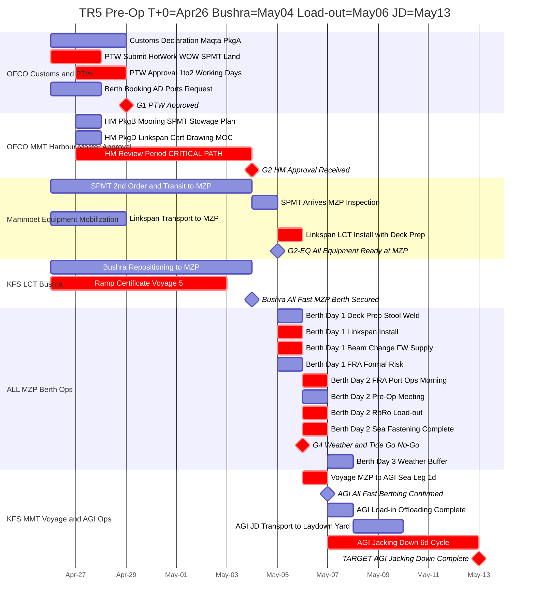

# TR5 (5항차) Pre-Operation Schedule - Final Plan

**Document ID:** HVDC-TR5-PREOP-FINAL-001  
**Rev:** v8.0  
**Issued:** 2026-03-29 (Asia/Dubai)  
**T+0 (Go Signal):** 2026-04-26 (Saturday)  
**LCT Bushra MZP All Fast:** 2026-05-04 (Sunday, T+8)  
**Target RoRo Load-out:** 2026-05-06 (Tuesday, T+10)  
**Target AGI Jacking Down Complete:** 2026-05-13 (Tuesday, T+17)  
**Critical Path Float:** 0.00d (TR5 to TR6 to TR7 serial)

---

## 1. TR1~TR4 실적 요약 (Actual History)

### 1.1 항차별 주요 실적

| 항차 | MZP All Fast | ETD | AGI Berthing | Port Turn | 비고 |
|------|-------------|-----|-------------|-----------|------|
| **TR1** | 2026-01-27 17:38 | 2026-01-31 20:36 | 2026-02-04 16:06 | 3.17d | 계획 대비 -2d 조기 완료 |
| **TR2** | 2026-02-09 21:18 | 2026-02-12 15:00 | 2026-02-13~14 | 2.74d | 2/11 짙은 안개 +3d 지연 |
| **TR3** | 2026-02-17 14:24 | 2026-02-19 03:00 | 2026-02-20~21 | 1.52d | 2/16 강풍 G27kt +1d 지연 |
| **TR4** | 2026-02-26 (est.) | **2026-02-27 08:42** | **2026-02-28 07:12** | **1.6d** | Feb 20 anchorage -> ~Feb 22 접안 -> Feb 24 Load-out -> Feb 27 08:42 ETD (실제) |

### 1.2 SSOT v1.1 확정 구간

| 구간 | 확정값 | 근거 |
|------|--------|------|
| Port Turn (MZP All Fast to ETD) | **3.00d** | TR4: Feb 26 to Mar 1 |
| Sea Leg (ETD to AGI Berthing) | **1.00d** | TR4: Mar 1 to Mar 2 |
| AGI Berthing to Jacking Down Complete | **6.00d** | TR4: Mar 2 to Mar 8 |

> **TR5 Port Turn 계획 2d (May 4 All Fast -> May 6 Load-out) vs TR1~TR4 평균 2.6d:**  
> TR1~TR4 실적 범위 = 1.5d(TR3 최단) ~ 4.5d(TR1 지연). **2d는 TR3 근접 - 달성 조건: 모든 서류 사전 완료, PTW G1(Apr29), HM G2(May4 동시), Linkspan May5 즉시 설치.**  
> 만약 서류 1개라도 미달 시 Port Turn +1~2d 연장 -> ETD May 7~8, JD Complete May 14~15.

### 1.2-B TR1~TR4 실제 서류 리드타임 (WhatsApp 기준)

> 기준: All Fast = D+0. 음수(-) = All Fast 이전, 양수(+) = 이후.

| 항차 | PTW 제출 | PTW 승인 | HM 접촉 | Linkspan | Pre-Op 미팅 | Load-out | Port Turn |
|------|---------|---------|---------|---------|------------|---------|----------|
| **TR1** | D+0 (Jan27) | D+3 (Jan30 PM 예외) | D+1 F2F (Jan28) | D+0 시도->D+4 예외 | D+2 F2F | D+4 (Jan31) | **4.1d** |
| **TR2** | D-4 (Feb5) | **D+0 (Feb9 AM)** | D+0 pre-op | D+2 계획->D+3 (안개) | D+0 (Feb9 11:00) | D+3 (Feb12) | **2.7d** |
| **TR3** | D-2 날짜변경 | **D+0 당일** | D+0 (연속) | D+0 LCT탑재 | D+0 (Feb17 15:00) | D+1 (Feb18) | **1.5d** |
| **TR4** | D-1 (Feb23) | **D+0 (Feb24 AM)** | D-1 15:00 | D-1 | D-4 Port FRA | D+1~2 | **~2.0d** |
| **평균** | **D-2** | **D+0~1** | D+0~1 | D+0~1 | D+0 | **D+1~3** | **~2.6d** |

> **TR5가 준비기간 8일로 연장된 이유 (TR1~TR4와 다른 이유):**
> 1. SPMT 2nd 신규 동원: 8일 필요 (TR1~TR4: 당일 또는 D-1 도착)
> 2. LCT Bushra 재배치: 8일 항해 (TR1~TR4: 연속 운항 7일 사이클)
> 3. 재가동(Restart): 2개월 공백, 모든 서류 만료 -> 신규 발급 8-10일 필요
> 4. **서류 승인 타이밍 자체(G1, G2)는 TR2~TR4 평균(D+0~1)과 동일 패턴 유지**

### 1.3 TR1~TR4 교훈 (WhatsApp 실적 기반)

> **TR1~TR4 실제 Port Turn 범위: 1.5d (TR3 최단) ~ 5d (TR4 anchorage 포함)**

| # | 실제 발생 사건 (WhatsApp) | TR5 적용 |
|---|--------------------------|---------|
| L-1 | **TR1: PTW Berth Day 3까지 미승인** - SPMT 이동 전면 중단, HM 예외 승인 후 가까스로 Load-out | T+0(Apr26) PTW 신청 필수. G1(Apr29) 이전 미승인 시 즉시 에스컬레이션 |
| L-2 | **TR1: Linkspan 인증서 미준비** - HM이 적재 불허, 공식 회의 후 예외 허가. 매 항차 재요구 확인 | Pkg-D(Linkspan Cert) T+1(Apr27) HM 제출 필수 |
| L-3 | **TR2: 짙은 안개** (Feb 11) - Load-out 1일 지연 (Feb 12 ETD) | G4 가시거리 2NM 이하 시 Hold. 버퍼 May 7 확보 |
| L-4 | **TR3: 강풍 G27kt** - 1일 지연 후 Feb 17 입항, Feb 19 ETD | G4 Wind 15kt 이하 기준 유지 |
| L-5 | **TR4: Berth #5 점유** - Feb 20 anchorage 대기, ~Feb 22 접안 (2일 손실) | Berth Booking T+0 즉시. Jetty #5 선점 필요 |
| L-6 | **SPMT 현재 AGI 섬** - MZP 반입 불가 | 2nd SPMT 신규 동원 (Option C). T+0 즉시 Mammoet 발주 |
| L-7 | **매 항차 서류 만료** - 전부 신규 발급 필요 | TR1 기존 엔지니어링 서류 HM 재사용 승인 확인 필요 |
| L-8 | **TR2: FRA+Pre-op 미팅 Berth Day 1에 진행** | Berth Day 1(May5) FRA, Day 2(May6) Pre-op+Load-out 순서 유지 |

---

## 2. TR5 운영 조건 (Operating Conditions)

### 2.1 SPMT 현황

- **현재 상태:** SPMT 1기 **AGI 섬** 위치 (MZP 반입 불가)
- **결정:** Option C - Mammoet **제2 SPMT 신규 동원** (MZP 직행)
- **소요:** T+0(Apr 26) 발주 -> T+8(May 4) MZP 도착

### 2.2 Linkspan 설치 조건

- **필수:** Load-out 전 **Deck Preparation 단계에서 동시 설치**
- **설치일:** Berth Day 1 (May 5, T+9) - Deck Prep과 병행
- **준비:** T+0 당일 운송 발주, T+3(Apr 29) MZP 도착, May 4 Bushra 접안 후 LCT 설치

### 2.3 인허가 서류 신규 갱신

> **전제:** TR4까지 사용 서류 전부 만료. 전부 신규 발급.

| 서류 패키지 | 내용 | 신청 시점 | 소요 | TR실적(평균) |
|------------|------|---------|------|------------|
| **Pkg-A** Customs Declaration | Maqta 세관 신고 | T+0 | 3 WD | 3 WD (매 항차 동일) |
| **Pkg-B** HM Mooring + SPMT Stowage | Harbour Master 심사용 | T+1 | **6 WD** (UAE Sun-Thu) | TR2: D-4 제출->D+0 승인. TR5는 8일 여유 (SPMT/재가동) |
| **Pkg-D** Linkspan Cert Drawing MOC | 선박 램프 인증 | T+1 | 5 days | TR2: D-4 제출->D+2~3 사용. TR3: 선탑재. TR4: D-1 |
| **Pkg-E** PTW (Hot Work / WOW / SPMT Land) | AD Ports 허가 3종 | T+0 | **1~2 WD** | TR2: D-4 제출->D+0 수령. TR4: D-1 신청->D+0 수령. 실적 1-2 WD |
| **Pkg-F** Berth Booking | AD Ports 선석 예약 | T+0 | 2일 | TR4: Feb23 HM->Feb24 Load-out. Gate Pass 당일 처리 가능 |
| **Pkg-G** Ramp Certificate Voyage 5 | KFS 항해 인증 | T+0 | 7 days | 매 항차 필요. 7일 리드타임 표준 |

---

## 3. TR5 Phase-Gate 일정

### 3.1 Gantt Chart



---

### 3.2 상세 타임라인 (T+0 ~ T+17)

| Day | 날짜 | 요일 | 활동 | Owner | Gate |
|-----|------|------|------|-------|------|
| **T+0** | Apr 26 | **토(주말)** | Go Signal. 킥오프 미팅(전화/이메일). PTW 3종 신청. Customs 신청. Linkspan 운송 발주. 2nd SPMT 발주. Bushra 포지셔닝 지시. Ramp Cert 신청. | Samsung/OFCO/MMT/KFS | - |
| **T+1** | Apr 27 | **일** | HM Pkg-B (Mooring/SPMT Stowage) 공식 제출. HM Pkg-D (Linkspan Cert) 제출. HM Review 시작. PTW 공식 접수. Berth Booking 신청. | OFCO/MMT | - |
| T+2 | Apr 28 | 월 | PTW 심사 중. Engineering 기존 문서 확인. Bushra 항해 중. SPMT 이동 중. | - | - |
| **T+3** | **Apr 29** | **화** | **G1: PTW 3종 승인** (2WD: Apr27+28). Linkspan MZP 도착. Customs 완료. | OFCO | **G1 PTW** |
| T+4 | Apr 30 | 수 | HM 심사 중. Bushra 항해 중. SPMT 이동 중. | - | - |
| T+5 | May 1 | 목 | HM 심사 중. Ramp Cert 진행 중. | - | - |
| T+6 | May 2 | **금(주말)** | - | - | - |
| T+7 | May 3 | **토(주말)** | HM 심사 완료 (6 cal days: Apr27~May3). | - | - |
| **T+8** | **May 4** | **일** | **Bushra MZP All Fast (입항).** 2nd SPMT MZP 도착. 장비 검사. **G2: HM Approval 발급** (Sat May3 -> Sun May4 처리). Ramp Cert 완료. | 전체 | **G2 HM + G2-EQ** |
| **T+9** | **May 5** | **월** | **Berth Day 1:** Deck Prep (Steel Pad/Stool Weld). **Linkspan LCT 설치 (Deck Prep 동시 진행)**. Beam Change. FW Supply. FRA 실시. 2nd SPMT 선상 셋업. | 전체 | - |
| **T+10** | **May 6** | **화** | **Berth Day 2 - TARGET LOAD-OUT.** Pre-Op Meeting/Toolbox Talk. FRA Port Ops. **RoRo Load-out SPMT Tidal 11:00~14:00**. Sea Fastening. Tide/Weather Go-NoGo. **ETD.** | 전체 | **G4 Tide** |
| T+11 | May 7 | 수 | Buffer: 기상 불가 시 대기. 또는 **AGI Berthing** (All Fast). AGI Load-in 개시. | KFS/ADNOC | - |
| T+11~12 | May 7~8 | - | AGI Load-in Offloading 완료. AGI JD Transport 착수. | MMT | - |
| T+11~17 | May 7~13 | - | **AGI Jacking Down 6.00d Cycle** | MMT/AGI | - |
| **T+17** | **May 13** | **화** | **TARGET: AGI Jacking Down 완료** | MMT | **FINAL** |

> **UAE 주말 참고:** 금/토 = 주말. Apr 26(토), May 2(금), May 3(토) 주말이나 해양/Mammoet 장비 이동은 계속 진행. HM/PTW 등 정부 기관 업무는 일(Sun)~목(Thu) 운영.

---

## 4. Gate 조건

### G1 - PTW Approved (Apr 29, T+3)

- **발급처:** AD Ports Authority
- **3종:** Hot Work / WOW / SPMT Land PTW
- **신청:** T+0(Apr 26) 이메일 -> T+1(Apr 27) 공식 접수 -> **1~2 WD(Apr27+28)** -> G1 Apr 29
- **실적근거:** TR2 D-4 신청->D+0 수령(1WD), TR4 D-1 신청->D+0 수령(1WD), TR1 D+0->D+3 (위기 대응). 평균 1~2 WD.
- **조건:** SPMT Land PTW 없이 SPMT 이동 불가

### G2 - HM Approval (May 4, T+8)

- **발급처:** Harbour Master, Mina Zayed
- **패키지:** Pkg-B (Mooring/SPMT Stowage) + Pkg-D (Linkspan Cert Drawing MOC)
- **심사:** T+1(Apr 27, UAE WD1) 제출 -> 6 WD(Apr27/28/29/30/May1/May4) -> **May 4(Sun) 발급**
- **TR1 교훈:** HM은 Linkspan 인증서 필수 요구. Pkg-D 미제출 시 G2 발급 거부.
- **중요:** T+1 제출 지연 시 Bushra 입항일 G2 미달 - Load-out 직접 영향

### G4 - Tide / Weather Go (May 6, T+10 or buffer May 7)

| 항목 | 기준 | 근거 |
|------|------|------|
| Wind Speed | 15 kt 이하 | TR3 G27kt 교훈 |
| Wave Height (Hs) | 1.25 m 이하 | Ramp operation 한계 |
| Visibility | 2 NM 이상 | TR2 안개 교훈 |
| Tide (MWL) | 1.5 m 이상 | Ramp 수심 조건 |
| Tidal Window | 11:00~14:00 GST | May 6 or May 7 |

---

## 5. 임계 경로 (Critical Path)

```
T+0 Apr26: Go Signal -> PTW 신청 / SPMT 발주 / Bushra 출발
        |
T+1 Apr27: HM Pkg-B+D 제출 -> HM Review 6d 시작
        |
T+3 Apr29: G1 PTW Approved
        |
T+8 May04: Bushra All Fast + G2 HM Approval + SPMT 도착
        |
T+9 May05: Berth Day 1 - Deck Prep + Linkspan 설치 + Beam Change
        |
T+10 May06: Berth Day 2 - RoRo Load-out + G4 Tide GO + ETD
        |
T+11 May07: Voyage 1.00d -> AGI Berthing
        |
T+17 May13: AGI Jacking Down Complete (6.00d)
```

**Float = 0.00d** (TR5 -> TR6 -> TR7 직렬)

---

## 6. 장비 동원 계획

| 장비 | 현재 위치 | 조치 | 소요 | MZP 도착 |
|------|---------|------|------|---------|
| **SPMT 1기** | AGI 섬 | 현 위치 유지 (회수 불필요) | - | - |
| **SPMT 2nd (신규)** | Mammoet 창고 | T+0(Apr26) 발주 -> 8일 | 8일 | **May 4 (T+8)** |
| **Linkspan** | AGI 또는 MZP 인근 | T+0 운송 발주 -> 3일 | 3일 | Apr 29 (T+3) |
| **LCT Bushra** | 현 위치 | T+0 포지셔닝 지시 -> 8일 항해 | 8일 | **May 4 (T+8)** |
| **Beam/Cradle** | 이전 항차 위치 | Bushra와 동시 운송 | 8일 | May 4 (T+8) |

> **Linkspan 설치 순서:** (1) Apr 29 MZP 도착 보관 -> (2) May 4 Bushra All Fast -> (3) May 5 Berth Day 1에 Deck Prep과 병행하여 LCT에 설치 -> G2-EQ 충족

---

## 7. 문서 패키지 체크리스트 (전부 신규 발급)

### Pkg-A: Customs / OFCO
- [ ] Customs Declaration Maqta (품목 신고서)
- [ ] Packing List / Commercial Invoice / Bill of Lading

### Pkg-B: Harbour Master
- [ ] Mooring Plan (5항차 갱신)
- [ ] SPMT Stowage Plan (2nd SPMT 반영)
- [ ] Ballast Plan / Stability Calculation (TR1~TR4 재사용 HM 확인 필요)

### Pkg-C: Engineering (기존 재사용)
- [ ] Stability Report / FEA / Ballast Calculation (TR1~TR4 기존 - HM 재사용 승인 필요)

### Pkg-D: Linkspan Certificate
- [ ] Linkspan Drawing MOC / Load Test Certificate / HM 제출용 Drawing

### Pkg-E: PTW (3종)
- [ ] Hot Work PTW / Working Over Water (WOW) PTW / SPMT Land PTW

### Pkg-F: Berth/Port
- [ ] Berth Booking (AD Ports) / Port Entry Permit / Gate Pass (장비/차량)

### Pkg-G: KFS / LCT
- [ ] Ramp Certificate Voyage 5 / LCT Crew Visa 갱신 / KFS Vessel Insurance


### Pkg-H: CICPA (AGI Island Access)
- [ ] **CICPA 갱신** - Mammoet 작업 크루 AGI 섬 출입 허가 (AD Ports/CICPA)
- [ ] **KFS 선원 AGI 접안 허가** - 선박 AGI Berth 접안용
- **신청 시점:** T+0(Apr26) 즉시. **소요:** 5~7 WD. **마감:** T+11(May7) AGI 도착 전
- **근거:** TR2 WhatsApp - Mammoet crew CICPA 미갱신으로 AGI 이동 1일 지연
---

## 8. 리스크 레지스터

| # | 리스크 | 확률 | 영향 | 대응 |
|---|--------|------|------|------|
| R-1 | HM Approval 지연 | HIGH | +3d | T+1(Apr27) 제출 필수. Pkg-B 사전 준비. |
| R-2 | 기상 불가 (안개/강풍) | MED | +1~2d | G4 버퍼 May 7 확보 |
| R-3 | Bushra 항해 지연 (기상/엔진) | MED | +1~2d | 8일 여유 내 모니터링. T+6까지 ETA 미확정 시 에스컬레이션 |
| R-4 | Linkspan 인증 지연 | MED | +2d | T+0 즉시 착수. Pkg-D T+1 제출. TR1 교훈: HM 필수 요구 |
| R-5 | 2nd SPMT 수급 불가 | MED | +5d | T+0 Mammoet 즉시 확인. 백업: Bushra AGI 회수 -> +3~4d |
| R-6 | PTW 지연 (정부 공휴일/심사 지연) | MED | +1~2d | TR1 교훈: 입항 후 PTW 미승인 -> 운영 전면 중단. T+0 즉시 신청 필수 |
| R-7 | MZP Berth 점유 | MED | +1~4d | Berth Booking T+0 즉시 신청. TR4 교훈: Feb20 anchorage 4일 대기 |
| R-8 | G2 HM May4 미발급 | LOW | +1d | May 3(Sat) 완료 -> May 4(Sun) 최종 수령 확인 |
| R-9 | Tidal Window 놓침 | MED | +1d | Go-NoGo May 6 오전 06:00 결정 |
| R-10 | 이란 상황 재악화 | EXT | 무기한 | Hold. ADNOC/Samsung HSE 판단 대기 |
| R-11 | **CICPA 갱신 지연** (AGI 크루 출입 불가) | MED | +1~2d | T+0 즉시 신청. TR2 교훈: 미갱신 시 AGI 도착 당일 승선 불가. T+8(May4)까지 완료 필수 |

---

## 9. 조직별 Action Items

### Samsung C&T (PM)
- [ ] T+0(Apr26): 킥오프 미팅 소집 (전화/화상)
- [ ] T+0: Go Signal 공식 문서화
- [ ] T+0: OFCO에 기존 엔지니어링 문서 재사용 가능 여부 확인 요청
- [ ] T+8(May4): HM Approval 수령 확인 -> Berth Day 1 집결 지시

### Mammoet (MMT)
- [ ] T+0(Apr26): **CICPA 갱신 신청** - Mammoet 크루 AGI 출입 허가 (5~7 WD, 마감 T+8 May4)
- [ ] T+0(Apr26): 2nd SPMT 가용 여부 즉시 확인 및 발주
- [ ] T+0: Linkspan 현재 위치 및 운송 Lead Time 확인
- [ ] T+1(Apr27): HM Pkg-B (SPMT Stowage Plan) 제출
- [ ] T+9(May5): Berth Day 1 - SPMT 셋업, Linkspan 설치, Beam Change 완료

### OFCO (서류 / PTW)
- [ ] T+0(Apr26): PTW 3종 이메일 신청
- [ ] T+0: Customs Maqta Declaration 제출
- [ ] T+0: Berth Booking AD Ports 신청
- [ ] T+1(Apr27): HM Pkg-B/D 공식 제출

### KFS (LCT Bushra)
- [ ] T+0(Apr26): Bushra MZP 포지셔닝 출발 지시
- [ ] T+0: Ramp Certificate Voyage 5 신청
- [ ] T+0: 인원 비자/Gate Pass 갱신 확인
- [ ] T+8(May4): MZP All Fast 확인 및 보고

---

## 10. 핵심 날짜 요약

| 이벤트 | 날짜 | 요일 | Day |
|--------|------|------|-----|
| Go Signal | 2026-04-26 | 토(주말) | T+0 |
| HM Pkg-B/D 제출 | 2026-04-27 | 일 | T+1 |
| G1 PTW Approved | 2026-04-29 | 화 | T+3 |
| Linkspan MZP 도착 | 2026-04-29 | 화 | T+3 |
| Ramp Certificate 완료 | 2026-05-03 | 토 | T+7 |
| **Bushra MZP All Fast (입항)** | **2026-05-04** | **일** | **T+8** |
| G2 HM Approval | 2026-05-04 | 일 | T+8 |
| SPMT 2nd MZP 도착 | 2026-05-04 | 일 | T+8 |
| **Berth Day 1** (Deck Prep + Linkspan 설치 + Beam Change) | **2026-05-05** | **월** | **T+9** |
| **TARGET RoRo Load-out** (Tidal 11:00~14:00 GST) | **2026-05-06** | **화** | **T+10** |
| G4 Tide/Weather Go | 2026-05-06 | 화 | T+10 |
| Buffer (Tide NG 시) | 2026-05-07 | 수 | T+11 |
| ETD (항해 개시) | 2026-05-06~07 | 화~수 | T+10~11 |
| AGI Berthing (All Fast) | 2026-05-07 | 수 | T+11 |
| AGI Load-in 완료 | 2026-05-07~08 | 수~목 | T+11~12 |
| **AGI Jacking Down 완료 (TARGET)** | **2026-05-13** | **화** | **T+17** |

**총 소요: T+0(Apr26) -> Load-out(May6) = 10일**  
**총 소요: T+0(Apr26) -> JD Complete(May13) = 17일**

---

## 11. 전제 조건 (Assumptions)

1. **T+0 = Apr 26 (토/주말):** Go Signal 발신 및 이메일/전화 발주는 주말 진행. 정부 기관 공식 업무는 Apr 27(일)부터 개시.
2. **엔지니어링 문서 재사용:** HM이 TR1~TR4 기존 Stability/FEA 재사용 허용 가정. 거부 시 +5d.
3. **SPMT 2nd 가용:** 8일 내 MZP 도착 가정. 불가 시 Bushra AGI 회수(Option A) -> +3~4일.
4. **Linkspan 위치:** MZP 또는 인근 3일 이내 도착 가정.
5. **조위창:** May 6, 7 중 하루 이상 11:00~14:00 GST 적정 조위 확보 가정.
6. **이란 상황:** Go Signal = 미이란 긴장 완화 및 UAE/ADNOC 안전 확인 완료 전제.

---

*Document end - HVDC-TR5-PREOP-FINAL-001 Rev v8.0*  
*Bushra MZP All Fast: 2026-05-04 | Target Load-out: 2026-05-06 | Target AGI JD: 2026-05-13*
