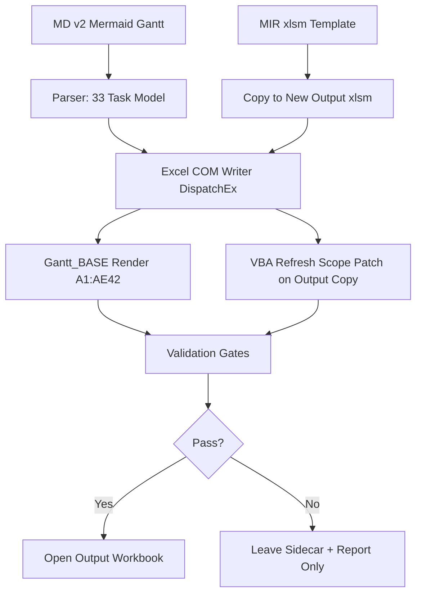

# PLAN: TR5 Gantt Workbook Generator 재설계

## Overview
TR5 사전 준비 시뮬레이션 Gantt Excel 산출물을 기존 `.xlsm` 직접 패치 방식에서 **B안: MIR template copy + Excel COM-only writer** 방식으로 재설계한다. 목적은 반복 오류의 원인이던 live workbook 충돌, openpyxl `.xlsm` 저장 부작용, VBA `Workbook_Open` timeline 재확장, 날짜/조건부서식 검증 불일치를 제거하는 것이다.

기준 일정은 `docs/일정/TR5_Pre-Op_Simulation_v2_20260430.md`의 Mermaid Gantt 33개 task이며, 최종 산출물은 매번 새 이름의 `.xlsm`으로 생성한다.

## Goals
- 기존 MIR `.xlsm`의 버튼, VBA, controls, drawing, 스타일을 유지한다.
- 원본 template과 사용자가 열어둔 workbook은 저장/닫기/덮어쓰기 하지 않는다.
- Excel 파일 저장은 Excel COM 단일 writer만 수행한다.
- `openpyxl`은 저장 금지, read-only 구조 검증에만 사용한다.
- 최종 검증은 Excel COM `.Text`, `.NumberFormat`, `.Value2`, macro smoke 기준으로 수행한다.
- 실패 시 성공 산출물로 보고하지 않고, run directory에 sidecar/report를 남긴다.

## Scope

### In Scope
- 새 generator 작성: `scripts/tr5_build_gantt_workbook.py`
- 새 VBA runner 작성: `scripts/Run_TR5_Gantt_Build.bas`
- MIR template copy 기반 새 `.xlsm` 생성
- MD v2 Mermaid Gantt 33개 task 파싱
- `Gantt_BASE` 시트 TR5 일정/서식/조건부서식 재작성
- output workbook copy에 한정한 VBA refresh 범위 보정
- Excel COM 표시 검증, macro smoke 검증, contract 검증
- `validation_report.json` 고정 schema 작성

### Out of Scope
- MIR template 원본 수정
- 사용자가 열어둔 workbook 저장/닫기/덮어쓰기
- Trust Center, registry, macro security 설정 자동 변경
- 기존 `tr5_fix_date_and_gantt_scope*.py` 계열의 추가 패치
- TR dashboard web app 코드 변경
- MD/HTML/PDF 일정 내용 변경

## Inputs and Outputs
- Template:
  - `C:\Users\SAMSUNG\Downloads\90_REVIEW_HOLD\MIR_Gantt_Full_Source_Set\MIR_Reactor_Repair_Schedule.xlsm`
- Schedule source:
  - `C:\tr_dash-main\docs\일정\TR5_Pre-Op_Simulation_v2_20260430.md`
- Output directory:
  - `C:\tr_dash-main\output\spreadsheet\tr5_preparation_simulation`
- Output filename:
  - `TR5_PreOp_Gantt_YYYYMMDD_HHMMSS.xlsm`
- Report:
  - `<run_dir>\validation_report.json`
- Log:
  - `<run_dir>\build.log`

## CLI Contract
```powershell
python scripts\tr5_build_gantt_workbook.py --open
```

Supported options:
```text
--template PATH
--schedule PATH
--out-dir PATH
--output-name NAME
--run-dir PATH
--no-open
--keep-sidecar
--dry-run
--fail-if-template-blocked
```

Exit codes:
- `0`: all mandatory gates pass, output generated, optional open succeeded if requested
- `1`: validation failed, output not approved
- `2`: preflight blocked execution
- `3`: unexpected exception, report written if possible

## Architecture


## Implementation Phases

### Phase 1: Preflight
- Verify template exists and is not locked.
- Verify schedule MD exists and parses.
- Verify output name does not overwrite an existing workbook unless explicitly provided and safe.
- Verify Python dependencies: `pywin32`, `openpyxl`.
- Verify Excel COM can start via `DispatchEx`.
- Verify template Mark-of-the-Web state.

### Phase 2: Parse Schedule
- Parse Mermaid Gantt from MD v2.
- Normalize each task into:
  - `id`
  - `phase`
  - `task`
  - `start`
  - `end`
  - `days`
  - `risk`
  - `note`
- Enforce task count = 33.
- Enforce final task:
  - `id = JDC`
  - `end = 2026-05-17`
  - `days = 0`
  - `risk = GATE`

### Phase 3: Generate Workbook
- Copy MIR template to timestamped output `.xlsm`.
- Open output copy only in isolated Excel COM instance.
- Disable events/macros during writer phase.
- Rewrite `Gantt_BASE` to TR5 layout:
  - active scope `A1:AE42`
  - timeline `K3:AE3`
  - timeline start `2026-04-27`
  - timeline end `2026-05-17`
  - right/bottom cleanup `AF:BO`, `43:80`
- Apply Risk validation:
  - `G4:G42`
  - values `OK, AMBER, HIGH, WARNING, CRITICAL, GATE`
- Apply conditional formatting:
  - Risk cells `G4:G42`
  - Gantt bars `K5:AE42`
- Preserve MIR tone/style.

### Phase 4: VBA and Config Patch
- Output copy only: never patch template.
- Patch or configure VBA refresh so `Workbook_Open`, `Init`, `Reset`, and color refresh do not expand timeline to `2026-04-15`.
- Ensure TR5 timeline reset range is fixed to:
  - `2026-04-27|2026-05-17`
- Preserve existing buttons and controls.

### Phase 5: Validation and Open
- Run all mandatory gates.
- Write `validation_report.json`.
- If all mandatory gates pass and `--open` is set, open the generated output workbook.
- Do not open failed sidecar as successful deliverable.

## Required Gates

### COM State Restore Gate
- Save original Excel Application state:
  - `AutomationSecurity`
  - `DisplayAlerts`
  - `EnableEvents`
  - `ScreenUpdating`
  - `Calculation`
- Before `Workbooks.Open`, set:
  - `AutomationSecurity = msoAutomationSecurityForceDisable`
  - `DisplayAlerts = False`
  - `EnableEvents = False`
- Restore all states in `finally`.
- Do not rely on cross-process automatic state restoration.

### VBProject Access Gate
- Confirm output copy allows:
  - `wb.VBProject.VBComponents.Count`
- If access fails, stop and report Trust Center requirement.
- Do not change Trust Center or registry automatically.

### Single-Instance Gate
- Use `DispatchEx("Excel.Application")`.
- Open only the output workbook in that isolated instance.
- Do not call calculation/save/close on user’s active Excel instance.
- `CalculateFullRebuild` is allowed only inside the isolated instance.

### Display Validation Gate
Mandatory Excel COM checks:
- `D31.Text == "2026-05-09"`
- `D31.NumberFormat == "yyyy-mm-dd"`
- `E31.Text == "2026-05-09"`
- `K3.Text == "04-27"`
- `K3.NumberFormat == "mm-dd"`
- `AE3.Text == "05-17"`
- `AE3.NumberFormat == "mm-dd"`
- `AF3.Value2 is None`
- row 3 height = `42`
- `K:AE` width = `5.0`

### Contract Gate
- Confirm package part presence/count:
  - `vbaProject.bin = 1`
  - drawings count unchanged
  - ctrlProps count unchanged
  - vmlDrawing count unchanged
- CRC changes are warnings only, not hard failures.
- Final judgment is based on open/reopen, macro smoke, controls, and display validation.

### Trust / MOTW Gate
- Check template and output for `Zone.Identifier`.
- If template is blocked or untrusted, stop and report:
  - unblock file, or
  - move template to Trusted Location.
- Do not lower macro security automatically.

### VBA Integrity Gate
- Verify no broken `VBProject.References`.
- Run workbook-qualified smoke macro:
```text
'<output>.xlsm'!modMIR_Gantt_Unified.Init_Unified_System
```
- After macro run, verify timeline remains `04-27 ~ 05-17`.

### Control Binding Gate
- Preserve button/control/shape counts from template.
- Verify Form/OLE controls still exist.
- Verify `OnAction` targets for `Init`, `Reset`, and `Show Notes` are not blank or broken.

### Workbook Config Gate
- Update hidden defined names related to reset/timeline in output copy only.
- Required:
```text
MIR_ORIG_TIMELINE_RANGE = "2026-04-27|2026-05-17"
```
- Reset must not restore `2026-04-15` timeline.

### Schedule Semantics Gate
- MD task count must be 33.
- Section rows are excluded from task count.
- `GATE` rows may have `0d`.
- Final task must remain:
```text
JDC / TARGET AGI Jacking Down Complete / 2026-05-17 / 0d / GATE
```
- VBA refresh must not convert final `0d` gate to `1d`.

### Locale Formula Gate
- Use Excel-compatible conditional-format formulas.
- Read `Application.International(xlListSeparator)`.
- Smoke test `FormatConditions.Add` in the local Excel environment.

### External Link Gate
- Record:
  - `LinkSources`
  - `Connections.Count`
- Fail only if links/connections trigger blocking prompts or unexpected refresh behavior.
- Otherwise report as warning.

### Report Contract Gate
`validation_report.json` must include:
```json
{
  "status": "success | blocked | validation_failed | exception",
  "output": "path",
  "run_dir": "path",
  "errors": [],
  "warnings": [],
  "gates": {},
  "contract": {},
  "display_validation": {},
  "opened": true
}
```

## Review Criteria
- Output workbook opens without repair prompt.
- Template original mtime/hash does not change.
- Existing open workbook is not saved, closed, or overwritten.
- `Gantt_BASE` displays only the intended range.
- Dates display correctly in Excel, not only in XML/openpyxl.
- Risk dropdown works.
- Risk selection changes Risk cell and Gantt bar color.
- Init/Reset/Show Notes remain callable.
- Reset does not expand timeline outside `K:AE`.
- `validation_report.json` gives enough evidence to reproduce pass/fail.

## Deliverables
- `scripts/tr5_build_gantt_workbook.py`
- `scripts/Run_TR5_Gantt_Build.bas`
- Generated workbook:
  - `output/spreadsheet/tr5_preparation_simulation/TR5_PreOp_Gantt_YYYYMMDD_HHMMSS.xlsm`
- Validation report:
  - `<run_dir>/validation_report.json`
- Log file:
  - `<run_dir>/build.log`

## Risks and Mitigations
- Risk: Trust Center blocks VBProject access.
  - Mitigation: stop with clear preflight error; do not change security settings.
- Risk: Excel COM leaves orphan process.
  - Mitigation: isolated `DispatchEx`, close workbook in `finally`, `Quit`, COM uninitialize.
- Risk: VBA Open event mutates timeline.
  - Mitigation: macro enabled reopen validation after VBA/config patch.
- Risk: openpyxl and Excel disagree on formats.
  - Mitigation: Excel COM display validation is authoritative.
- Risk: locale formula separators break CF.
  - Mitigation: local separator discovery and CF smoke test.
- Risk: template controls break after save.
  - Mitigation: control count and `OnAction` validation.

## Assumptions
- B안 is the approved approach.
- MIR template should preserve VBA/buttons/style.
- Output is always a new `.xlsm`; overwrite is not the default.
- Excel desktop and pywin32 are available on the execution machine.
- User does not require automatic Trust Center/security changes.
- `TR5_Pre-Op_Simulation_v2_20260430.md` remains the schedule SSOT for this workbook.
