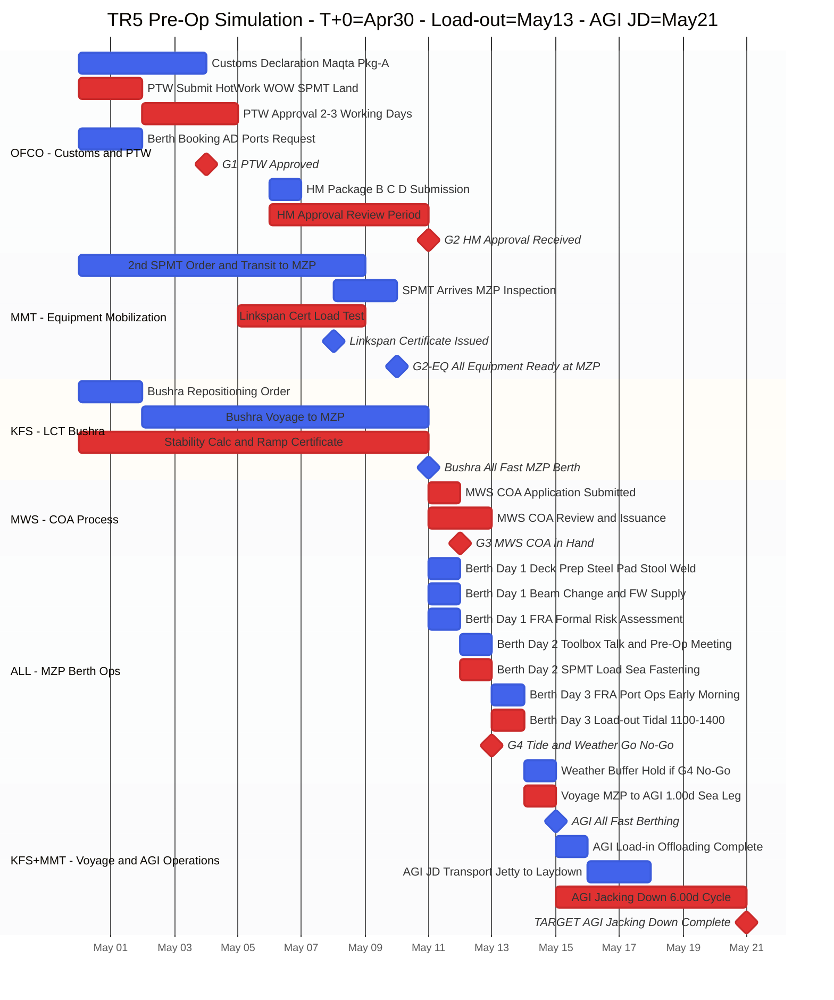
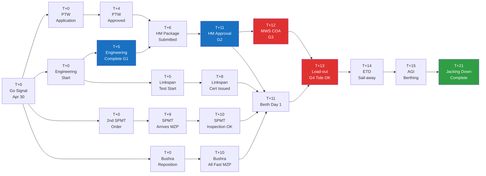

# TR5 (5항차) Pre-Operation Simulation Plan

**Doc No.:** HVDC-TR5-SIM-001  
**Date:** 2026-03-29  
**Scenario:** US-Iran stabilization → Go Signal received  
**T+0 (Go Signal):** 2026-04-30 (Wednesday)  
**Data Source:** SSOT v1.1 (Cycle 7.00d) + TR1~TR4 Actual  
**Status:** SIMULATION — Not yet confirmed for operations

---

## Change Log

| Rev | Date | Author | Description |
|-----|------|--------|-------------|
| SIM-v1.0 | 2026-03-29 | (author) | Initial issue — Iran stabilization scenario, Go Signal Apr 30 |

---

## Table of Contents

1. [Scenario Assumptions](#1-scenario-assumptions)
2. [SSOT Segment Durations](#2-ssot-segment-durations)
3. [Phase-Gate Gantt Chart](#3-phase-gate-gantt-chart)
4. [Detailed Milestone Timeline](#4-detailed-milestone-timeline)
5. [Document Package Checklist](#5-document-package-checklist)
6. [Equipment Mobilization Plan](#6-equipment-mobilization-plan)
7. [Hold Points and Gate Criteria](#7-hold-points-and-gate-criteria)
8. [Risk Register](#8-risk-register)
9. [Action Items by Organization](#9-action-items-by-organization)
10. [Critical Path Analysis](#10-critical-path-analysis)

---

## 1. Scenario Assumptions

| Item | Content |
|------|---------|
| **Trigger** | US-Iran diplomatic agreement → regional security stabilized → Samsung C&T internal Go Signal |
| **T+0 (Go Signal Date)** | 2026-04-30 (Wednesday) |
| **SPMT Status** | SPMT Unit 1: currently at AGI site. **New 2nd SPMT mobilized to MZP** (Option C) |
| **LCT Bushra** | Current location TBC — repositioning to MZP required |
| **Document Status** | All permits/certificates assumed EXPIRED → full new applications required |
| **Operating Framework** | Same procedure as TR1–TR4. UAE weekend (Fri/Sat) applied |
| **Target Load-out** | 2026-05-13 (Tue) — Tidal window 11:00–14:00 GST |
| **AGI Jacking Down** | 2026-05-21 (Thu) |

---

## 2. SSOT Segment Durations

Confirmed values from SSOT v1.1 + TR1–TR4 actuals.

| Segment | Duration | Basis |
|---------|----------|-------|
| **Port Turn** (MZP Berthing → ETD) | **3.00d** | TR4: Feb 26 → Mar 1 confirmed |
| **Sea Leg** (ETD → AGI Berthing) | **1.00d** | TR4: Mar 1 → Mar 2 |
| **AGI Berthing → Load-in** | **1.00d** | TR4: Mar 2 → Mar 3 |
| **AGI Berthing → Jacking Down** | **6.00d** | TR4: Mar 2 → Mar 8 |
| **Cycle** (MZP ETD → next MZP Berthing) | **7.00d** | 2-voyage average |
| **Pre-arrival prep** (Go Signal → LCT Berth) | **11–12 days** | TR1 actual 10d + new SPMT +2d |

> **Original SSOT v1.1 TR5 plan:** MZP Berthing 2026-03-05 → ETD 2026-03-08 → AGI JD 2026-03-15  
> **This simulation (Apr 30 Go):** MZP Berthing ~2026-05-11 → Load-out ~2026-05-13 → AGI JD ~2026-05-21

---

## 3. Phase-Gate Gantt Chart

---

## 4. Detailed Milestone Timeline

UAE Weekend = Friday/Saturday

| Day | Date | Day | Key Activity | Owner | Gate |
|-----|------|-----|--------------|-------|------|
| **T+0** | Apr 30 | Wed | Go Signal. Kick-off meeting. Engineering starts. PTW submitted (Hot Work / WOW / SPMT Land). Customs Declaration submitted. 2nd SPMT order placed (Mammoet). Bushra repositioning instructed. | Samsung / OFCO / MMT | — |
| T+1 | May 1 | Thu | Engineering ongoing. Maqta upload confirmed (ref no. received). Linkspan cert process starts. | Aries / OFCO | — |
| T+2 | May 2 | **Fri** | **UAE Weekend** | — | — |
| T+3 | May 3 | **Sat** | **UAE Weekend** | — | — |
| T+4 | May 4 | Sun | PTW approval received (2–3 working days). Customs complete. Engineering final review. | OFCO / Aries | — |
| **T+5** | May 5 | Mon | **Engineering complete** (Stability + FEA + Ballast). Linkspan Load Test conducted. SPMT in transit. | Aries / MMT | **G1** |
| T+6 | May 6 | Tue | Linkspan Certificate issued. HM Package B/C/D submitted in full (OFCO → AD Ports). | MMT / OFCO | — |
| T+7 | May 7 | Wed | HM review ongoing. Packing List + Stowage Plan submitted. 2nd SPMT approaching MZP. | OFCO / MMT | — |
| T+8 | May 8 | Thu | 2nd SPMT arrives MZP. 3rd-party equipment inspection starts. Bushra in transit. | MMT / NAS | — |
| T+9 | May 9 | **Fri** | **UAE Weekend** — awaiting HM | — | — |
| T+10 | May 10 | **Sat** | **UAE Weekend** | — | — |
| **T+11** | May 11 | Sun | **HM Approval received. LCT Bushra MZP All Fast.** **Berth Day 1**: ① **Deck Preparation** — Steel Pad 제거/분리, Stool 제거, 신규 Steel Pad 용접 위치 마킹 (Crane ≥25t, DECK_PREP_WELD). ② Beam change + FW supply. MWS COA application submitted. | All | **G2** |
| **T+12** | May 12 | Mon | Berth Day 2: SPMT loading + Ramp setup + Sea Fastening Cert (NAS witness). **MWS COA issued.** Pre-Operation Meeting. Port Resources confirmed. | MMT / NAS / All | **G3** |
| **T+13** | May 13 | Tue | **Berth Day 3 — Load-out Target.** Tidal window **11:00–14:00 GST**. Tide confirmed by MMT Marine Supervisor. Weather Go/No-Go (KFS Master + MWS). Sea Fastening complete → ETD. | All | **G4** |
| T+14 | May 14 | Wed | Buffer — weather hold if required. OR voyage underway (MZP → AGI). | KFS | — |
| T+14–15 | May 14–15 | — | **Voyage** MZP → AGI (1.00d). 6h stability check. Daily reporting. | KFS | — |
| **T+15** | May 15 | Fri | **AGI Berthing (All Fast).** Mooring verification. SPMT reconfiguration starts (14 → 10 axle per AGI spec). | KFS / MMT | — |
| T+16 | May 16 | Sat | UAE Weekend — Unlashing + steel pad removal (may start earlier). | MMT | — |
| T+16–17 | May 16–17 | — | **AGI Load-in complete.** SPMT moves to AGI yard. | MMT | — |
| T+17–19 | May 17–19 | — | AGI JD/Transport (Jetty → Laydown yard). | MMT / AGI | — |
| **T+21** | **May 21** | **Thu** | **AGI Jacking Down complete** (AGI Berthing +6.00d). Final report initiated. | MMT / Samsung | — |
| T+21–28 | May 21–28 | — | Demobilization. LCT return. Close-out Report (within 7 days). | All | — |

---

## 5. Document Package Checklist

All documents assumed expired — full new applications required.

### Package A — Customs (AD Ports / Maqta Gateway)

| # | Document | Owner | Deadline | Note |
|---|----------|-------|----------|------|
| A1 | Cargo Declaration | OFCO | T+3 | Upload to Maqta Gateway |
| A2 | Manifest | OFCO | T+3 | |
| A3 | TR5 Packing List (incl. all SPMT+PPU S/N) | Mammoet → OFCO | T+3 | TR2 lesson: full S/N list required |

### Package B — Harbour Master (HM)

| # | Document | Owner | Deadline | Note |
|---|----------|-------|----------|------|
| B1 | Mooring Plan | Aries / KFS | T+6 | |
| B2 | SPMT Certificate (incl. 2nd SPMT) | Mammoet | T+6 | New SPMT cert added |
| B3 | Stowage Plan | Mammoet | T+6 | |
| B4 | Ramp Certificate | Aries / KFS | T+6 | Per-voyage renewal |

### Package C — PTW / HSE (AD Ports)

| # | Document | Owner | Deadline | Note |
|---|----------|-------|----------|------|
| C1 | PTW — Hot Work | MMT draft / OFCO submit | T+0 same day | Voyage-specific, new each trip |
| C2 | PTW — Working Over Water (WOW) | MMT draft / OFCO submit | T+0 same day | |
| C3 | PTW — Land Oversized & Heavy Load (SPMT) | MMT draft / OFCO submit | T+0 same day | Weekend may add +1d |
| C4 | Risk Assessment | Mammoet | T+1 | |
| C5 | Method Statement | Mammoet | T+1 | |

### Package D — Linkspan / Port (HM / AD Ports)

| # | Document | Owner | Deadline | Note |
|---|----------|-------|----------|------|
| D1 | Linkspan Certificate | Mammoet | T+8 | TR1/TR3 lesson: secure early |
| D2 | Load Test Evidence | Mammoet | T+8 | Required for certificate |
| D3 | Linkspan Drawing | Mammoet | T+6 | |
| D4 | MOC (Method of Construction) | Mammoet | T+6 | |

### Package E — Marine Pre-Sail

| # | Document | Owner | Deadline | Note |
|---|----------|-------|----------|------|
| E1 | Sea Fastening Certificate | MMT / NAS | Berth Day 2 | NAS witness required on site |
| E2 | Stability Report (TR5) | KFS | T+10 | |
| E3 | **MWS COA (Voyage 5)** | NAS | **T+12 (G3)** | No COA = no departure (HP-3) |
| E4 | Voyage Plan | KFS | T+12 | |
| E5 | Delivery Note (Customs) | Samsung / OFCO | T+10 | |
| E6 | Undertaking / Indemnity Letters | Samsung | T+6 | |
| E7 | AD Maritime NOC | OFCO | T+6 | |

---

## 6. Equipment Mobilization Plan

### New Equipment for MZP (from T+0)

| Equipment | Qty | Source | Target Arrival MZP | Note |
|-----------|-----|--------|-------------------|------|
| 2nd SPMT (new mob) | 1 set | Mammoet regional depot | **T+9 (May 9)** | Option C — new mobilization |
| Linkspan | 1 set | Mammoet | T+4 | Check reuse of existing unit |
| PPU (Power Pack Unit) | 1 set | Mammoet | T+9 | Arrives with SPMT |
| LCT Bushra | 1 vessel | KFS | **T+10 (May 10)** | Voyage from current position |

### MZP Port Equipment Request (Submit ≥24h in advance)

| Equipment | Qty | Request Time | Purpose |
|-----------|-----|-------------|---------|
| Crane ≥ 25t | 1 | Berth Day 1 -1 day 07:00 | Deck prep + Linkspan setup |
| Forklift 10t | 2 | 08:00 | Beam change + shifting |
| Forklift 5t | 1 | 08:00 | RoRo ramp |
| Gang | 1 team | 08:00 | Steel works |
| Mafi trailer | as req. | — | Equipment movement |

> **Flow:** Mammoet → OFCO → MZ GC Ops (Deadline: Berth Day 1 -1 day, 24:00)

---

## 7. Hold Points and Gate Criteria

Per HVDC_TR_Standard_Operating_Guide_v1.0.md — unchanged from TR1–TR4.

| HP | Gate | Condition | Authority |
|----|------|-----------|-----------|
| **HP-1** | G1 | No Land PTW → SPMT movement prohibited | OFCO / AD Ports |
| **HP-2** | G2 | No Linkspan Certificate → Load-out prohibited | Mammoet / NAS |
| **HP-3** | G3 | No MWS COA → departure prohibited | NAS (MWS) |
| **HP-4** | G4 | Tide/Weather criteria not met → Load-out suspended | KFS Master + MMT Marine Supervisor |
| **HP-5** | — | Port resources not confirmed → operations suspended | OFCO / MZ GC Ops |

### G4 Weather Criteria (TR5 Application)

| Parameter | Go | No-Go |
|-----------|----|-------|
| Wind speed | ≤ 15 kt sustained | > 15 kt or gust ≥ 25 kt |
| Wave height (Hs) | Slight (≤ 1.25 m) | Moderate or above (> 1.25 m) |
| Visibility | ≥ 2 NM | Fog / visibility < 2 NM |
| Tide at MZP | ≥ 1.5 m at load-out time | Ramp angle ≥ ±2° |

---

## 8. Risk Register

Lessons learned from TR1–TR4 applied.

| # | Risk | Source Trip | Impact | Mitigation | Owner |
|---|------|-------------|--------|------------|-------|
| R1 | PTW weekend delay +1d | TR1–TR4 all | +1d | Submit T+0 immediately | OFCO |
| R2 | Linkspan Certificate late | TR1, TR3 | Load-out blocked | Start T+5. Pre-schedule Load Test with NAS | MMT / NAS |
| R3 | MZP Berth occupied (other vessel) | TR4 (+4d) | +2–4d | D-3, D-1 OFCO confirms berth availability | OFCO |
| R4 | FOG at MZP | TR2 (+1d) | Load-out cancelled | Buffer Day T+14 in plan. May fog frequency low | KFS |
| R5 | Strong wind at MZP | TR3 (+3d) | Load-out cancelled | 5-day forecast monitoring. NCM + Windfinder | KFS / MWS |
| R6 | 2nd SPMT arrival delay | New (Option C) | +2–3d | Order T+0 immediately. Explore nearest Mammoet project for temporary borrow | Mammoet |
| R7 | HM Approval delay (weekend) | TR1–TR4 | +1–2d | Submit T+6. Confirm receipt before Friday | OFCO |
| R8 | AGI Berth occupied (DSV etc.) | Near TR4 | +0.5–2d | D-3, D-1 confirm with ADNOC L&S | Samsung + ADNOC L&S |
| R9 | AGI FRA approval delay | TR1 (+3d) | +2–3d | AGI Team D-1 check. Pre-process FRA renewal | Samsung AGI |
| R10 | Maqta Gateway system failure | — | +1–2d | Submit 1–2 days early. Manual submission via OFCO as fallback | OFCO |

---

## 9. Action Items by Organization

### Samsung C&T (PM)

| # | Action | Deadline | Note |
|---|--------|----------|------|
| S1 | Internal Go Signal approval + kick-off meeting | T+0 (Apr 30) | |
| S2 | Undertaking / Indemnity Letters | T+5 | |
| S3 | Delivery Note (AD Customs) | T+10 | |
| S4 | AGI Team: confirm berth availability D-1 | T+12 | |
| S5 | Chair Pre-Operation Meeting | T+12 | |
| S6 | Initiate Close-out Report | Within T+21+7 | Within 7 days of completion |

### Mammoet (MMT) — Yulia

| # | Action | Deadline | Note |
|---|--------|----------|------|
| M1 | Place 2nd SPMT mobilization order (check regional depot) | **T+0 same day** | Top priority |
| M2 | TR5 Packing List (all SPMT + PPU S/N) | T+3 | TR2 lesson: no missing S/N |
| M3 | Linkspan Certificate + Load Test initiation | T+5 | TR1/TR3 lesson: early start |
| M4 | PTW drafts (Hot Work / WOW / SPMT) → handover to OFCO | T+0 same day | |
| M5 | Method Statement + Risk Assessment | T+1 | |
| M6 | HM Package B/D (SPMT cert, Stowage Plan, Linkspan Drawing) | T+6 | |
| M7 | Sea Fastening Certificate (Berth Day 2, NAS witness) | T+12 | |
| M8 | SPMT reconfiguration at AGI (14 → 10 axle) | After AGI Berthing | Per AGI spec |
| M9 | MZP Port Resources request (Crane ≥25t, Forklift) | Berth Day 1 -1d 24:00 | Via OFCO → MZ GC Ops |
| M10 | **Deck Preparation plan** — Steel Pad 제거 순서, Stool 위치, 신규 Pad 용접 도면 확인 | **T+10** | DECK_PREP_WELD = Berth Day 1 즉시 시작. Crane ≥25t 필수 |

### OFCO (Agency)

| # | Action | Deadline | Note |
|---|--------|----------|------|
| O1 | Submit PTW (Hot Work / WOW / SPMT) via Maqta/ATLP | T+0 same day | New voyage-specific submission |
| O2 | Customs Declaration Package A — Maqta upload | T+3 | Share ref no. with Samsung |
| O3 | FRA (MZP) early morning arrangement | T+1 | For Load-out day early morning |
| O4 | MZP Berth booking (3 days: Berth Day 1–3) | T+5 | Confirm D-3 |
| O5 | AD Maritime NOC application | T+5 | |
| O6 | HM Package full submission | T+6 | |
| O7 | Port Resources request relay (MMT → GC Ops) | Berth Day 1 -1d 24:00 | |

### KFS (LCT Bushra)

| # | Action | Deadline | Note |
|---|--------|----------|------|
| K1 | Confirm Bushra current position + MZP repositioning plan | T+1 | |
| K2 | Stability Calculation (TR5) | T+10 | |
| K3 | Ramp Certificate (Voyage 5) | T+10 | |
| K4 | Tide confirmation on load-out morning (with MMT Marine Supervisor) | T+13 | Tidal window 11:00–14:00 |
| K5 | Final Weather Go/No-Go call | T+13 07:00 | Based on MWS + NCM forecast |

### NAS (MWS — Abu Dhabi Maritime Authority)

| # | Action | Deadline | Note |
|---|--------|----------|------|
| N1 | Attend Linkspan Load Test + issue certificate | T+8 | |
| N2 | Witness Sea Fastening on Berth Day 2 | T+12 | |
| N3 | Issue MWS COA (Voyage 5) | **T+12 (G3 Gate)** | Mandatory before departure |

---

## 10. Critical Path Analysis

### Critical Path Summary

| Milestone | Date | Delay Impact |
|-----------|------|-------------|
| PTW Approval | May 4 (T+4) | Delay → HM package cannot be submitted |
| Engineering Complete | May 5 (T+5) | Delay → HM package incomplete |
| **HM Approval** | May 11 (T+11) | ⚠️ Weekend may add +1–2d |
| **MWS COA received** | May 12 (T+12) | No COA = no departure (absolute blocker) |
| **Load-out** | May 13 (T+13) | Weather hold → May 14 buffer available |
| AGI Jacking Down | May 21 (T+21) | Full cycle complete |

### Schedule Summary

| Scenario | Load-out | AGI JD | Total Days |
|----------|----------|--------|-----------|
| **Best case** (all approvals on time) | May 12 | May 18 | 18d |
| **Base case** (this plan) | **May 13** | **May 21** | **22d** |
| **Worst case** (R3+R5 both hit) | May 16+ | May 25+ | 26d+ |

---

## Reference Documents

| Document | Location | Purpose |
|----------|----------|---------|
| SSOT v1.1 | `docs/일정/일정.MD` | TR4–TR7 baseline schedule |
| AGI TR Final Report | `docs/일정/AGI_TR_일정_최종보고서_FINAL.MD` | TR1–TR4 actual data |
| DPR Verification | `docs/일정/Mammoet_DPR_Verification_v4_최종보고서.md` | Delay root cause analysis |
| TR5 Pre-arrival Notice | `docs/일정/5항차.md` | Hold Points, document packages |
| SOP Guide | `docs/HVDC_TR_Standard_Operating_Guide_v1.0.md` | Full operations procedure |

---

*This document is a SIMULATION PLAN. Upon confirmed Go Signal and operational approval, to be upgraded to "Issued for Use" version after stakeholder review.*  
*Cost figures, contact details, and specific contractual terms to be verified against contract documents.*
