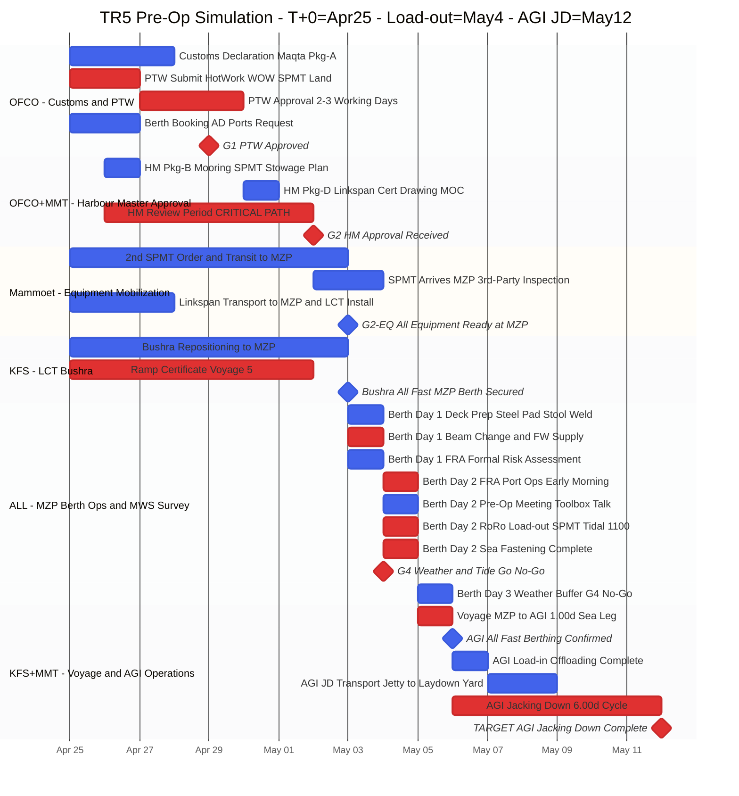
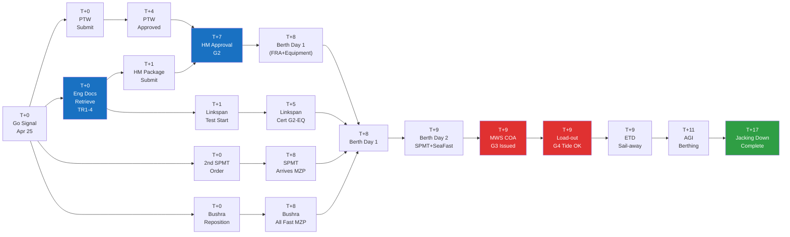

# TR5 (5항차) Pre-Operation Simulation Plan

**Doc No.:** HVDC-TR5-SIM-002  
**Date:** 2026-03-29  
**Scenario:** US-Iran stabilization → Go Signal received  
**T+0 (Go Signal):** 2026-04-25 (Saturday)  
**Data Source:** SSOT v1.1 (Cycle 7.00d) + TR1–TR4 Actual  
**Key Assumption:** TR5 = same cargo (same TR unit type, same vessel LCT Bushra) as TR1–TR4.  
Engineering calculations (Stability, FEA, Ballast) are REUSED from previous voyages — no recalculation required.  
**MWS:** Marine Warranty Survey — pre-departure approval report issued by the Marine Warranty Surveyor before each voyage.  
**Status:** SIMULATION — Not yet confirmed for operations

---

## Change Log

| Rev | Date | Author | Description |
|-----|------|--------|-------------|
| SIM-v1.0 | 2026-03-29 | (author) | Initial issue |
| SIM-v2.0 | 2026-03-29 | (author) | Engineering calc track removed — same cargo TR1–TR4. Timeline revised. |
| SIM-v2.1 | 2026-03-29 | (author) | Removed all Aries references. NAS corrected to MWS Surveyor (Marine Warranty Surveyor). Mermaid graphs patched. |
| SIM-v2.2 | 2026-03-29 | (author) | Gantt Section 3 rebuilt: Engineering section deleted; Approvals B (HM+MWS wrong combo) split into correct tracks -- HM Approval (port authority) separate from MWS Survey (on-site during Berth Day 2, COA issued before load-out). Based on TR1 actual email sequence. |
| SIM-v2.3 | 2026-03-29 | (author) | Gap-fill vs AGI_TR_일정_최종보고서 + SOP Guide: (1) MWS COA timing fix T+8->T+9 (Sea Fastening first); (2) FRA meeting added T+8; (3) Toolbox Talk + Ramp Alignment + Ballasting added Berth Day 2; (4) Weather monitoring URLs (NCM Al Bahar, tide-forecast, OMAA METAR); (5) R11 SPMT Gate Pass AGI, R12 Weekend ops risks added; (6) Section 11 Cascade Impact Float=0 added; (7) Critical Path flowchart G3 node corrected T+9. |
| SIM-v2.4 | 2026-03-29 | (author) | Gantt design upgrade: %%{init}%% custom theme, crit tags on Critical Path, axisFormat %b %d, Owner prefix in sections, task names with -- separators, named milestones G1-G4. |
| SIM-v2.8 | 2026-03-29 | (author) | STAGE 수정: FRA Port Ops + Pre-Op + RoRo Load-out + Sea Fastening + MWS COA + G3 + G4 전부 Berth Day 2(T+9)로 통합. Berth Day 3 = Weather Buffer 전용. ETD=T+9 당일, AGI=T+11, JD=T+17. SSOT Berthing+1d=Load-out 일치. |
| SIM-v2.7 | 2026-03-29 | (author) | Berth Day 스테이지 오류 수정: FRA(Formal Risk Assessment)와 Pre-Op Meeting 분리. Berth Day 1=Deck Prep+Beam Change+FRA(HSE). Berth Day 2=Toolbox Talk+Pre-Op Meeting+SPMT+Sea Fast+MWS COA. Berth Day 3=FRA(Port Ops Auth 이른아침)+Load-out. 근거: SOP Step 2.5(FRA=D-4)/Step 2.10(Pre-Op=D-1)/Step 3.5(Toolbox=D0), 5항차.md("FRA 02-Mar early morning"=load-out 당일). |
| SIM-v2.9 | 2026-04-23 | (author) | Load-out 날짜 시프트: May 9 → May 4. T+0 Apr 30 → Apr 25. 전체 일정 −5일 cascade. AGI JD May 17 → May 12. |

---

## Table of Contents

1. [Scenario Assumptions](#1-scenario-assumptions)
2. [SSOT Segment Durations](#2-ssot-segment-durations)
3. [Phase-Gate Gantt Chart](#3-phase-gate-gantt-chart)
4. [Detailed Milestone Timeline](#4-detailed-milestone-timeline)
5. [Document Package Checklist](#5-document-package-checklist)
6. [Equipment Mobilization Plan](#6-equipment-mobilization-plan)
7. [Hold Points and Gate Criteria](#7-hold-points-and-gate-criteria)
8. [Risk Register](#8-risk-register)
9. [Action Items by Organization](#9-action-items-by-organization)
10. [Critical Path Analysis](#10-critical-path-analysis)

---

## 1. Scenario Assumptions

| Item | Content |
|------|---------|
| **Trigger** | US-Iran diplomatic agreement → regional security stabilized → Samsung C&T internal Go Signal |
| **T+0 (Go Signal Date)** | 2026-04-25 (Saturday) |
| **SPMT Status** | SPMT Unit 1: currently at AGI site. **New 2nd SPMT mobilized to MZP** (Option C) |
| **LCT Bushra** | Current location TBC — repositioning to MZP required |
| **Engineering Docs** | REUSED from TR1–TR4 (same cargo weight, dimensions, vessel). Submit existing approved docs to HM / MWS Surveyor directly. |
| **Permit Status** | PTW, HM Approval, MWS COA: all voyage-specific → full new applications required |
| **Customs / Packing List** | New submission per voyage required |
| **Operating Framework** | Same procedure as TR1–TR4. UAE weekend (Fri/Sat) applied |
| **Target Load-out** | **2026-05-04 (Mon)** — Berth Day 2, Tidal window 11:00–14:00 GST |
| **AGI Jacking Down** | **2026-05-12 (Tue)** |

> **Why shorter than original plan?** Removing engineering calc track (was T+0→T+5) allows HM Package to be submitted on T+1 using existing approved docs, advancing HM Approval by ~5 days. Total prep compresses from ~13 days to **~8–9 days**.

---

## 2. SSOT Segment Durations

| Segment | Duration | Basis |
|---------|----------|-------|
| **Port Turn** (MZP Berthing → ETD) | **3.00d** | TR4: Feb 26 → Mar 1 confirmed |
| **Sea Leg** (ETD → AGI Berthing) | **1.00d** | TR4: Mar 1 → Mar 2 |
| **AGI Berthing → Load-in** | **1.00d** | TR4: Mar 2 → Mar 3 |
| **AGI Berthing → Jacking Down** | **6.00d** | TR4: Mar 2 → Mar 8 |
| **Cycle** (MZP ETD → next MZP Berthing) | **7.00d** | 2-voyage average |
| **Pre-arrival prep** (Go Signal → LCT Berth) | **~8 days** | Engineering reuse removes 5-day calc track |

---

## 3. Phase-Gate Gantt Chart

---

## 4. Detailed Milestone Timeline

UAE Weekend = Friday / Saturday

| Day | Date | Day | Key Activity | Owner | Gate |
|-----|------|-----|--------------|-------|------|
| **T+0** | Apr 25 | **Sat** | Go Signal (긴급 접수). Kick-off meeting. Retrieve and confirm existing engineering docs from TR1–TR4. PTW submitted (Hot Work / WOW / SPMT Land). Customs Declaration submitted to Maqta. 2nd SPMT order placed. Bushra repositioning instructed. | Samsung / OFCO / MMT | — |
| **T+1** | Apr 26 | Sun | Existing engineering docs re-submitted to HM and MWS Surveyor. **HM Package B/C/D submitted** (using existing docs). Linkspan transport to MZP instructed. | Samsung / OFCO | **G1** |
| T+2 | Apr 27 | Mon | PTW approval working day 2. Linkspan in transit. SPMT order confirmed. | OFCO / MMT | — |
| T+3 | Apr 28 | Tue | PTW approval working day 3. Customs Declaration in progress. | OFCO | — |
| **T+4** | Apr 29 | Wed | **PTW Approval received** (2–3 working days from T+0). Customs Declaration complete. Linkspan arrives MZP — LCT install begins. | OFCO / MMT | **G1-PTW** |
| T+5 | Apr 30 | Thu | Linkspan installed on LCT. HM review ongoing. SPMT in transit. Ramp Certificate finalizing. | MMT / KFS | — |
| T+6 | May 1 | **Fri** | **UAE Weekend** — HM review ongoing | — | — |
| T+7 | May 2 | **Sat** | **UAE Weekend** — **HM Approval received** (6d review from T+1). SPMT 2nd arrives MZP. Equipment 3rd-party inspection complete. | All | **G2** |
| **T+8** | May 3 | Sun | LCT Bushra All Fast at MZP. **Berth Day 1**: ① **Deck Preparation** — Steel Pad 제거·Stool 분리·갑판 청소·신규 Pad 마킹 (DECK_PREP_WELD, Crane ≥25t). ② Beam Change + FW Supply. ③ **FRA (Formal Risk Assessment)** — AD Ports HSE 참석 안전 리스크 평가 회의 (SOP Step 2.5). MWS Surveyor on-site 도착 확인. | MMT / KFS / AD Ports HSE | — |
| **T+9** | May 4 | **Mon** | **Berth Day 2 = Load-out Day**: ① **FRA (Port Ops Authorization) 이른 아침** — OFCO 주선, AD Ports 당일 운영 허가. ② **Toolbox Talk** (All hands, Hot Work 포함) + **Pre-Operation Meeting** (Samsung+MMT+KFS+OFCO+ADNOC L&S). ③ Ramp Alignment 실측 + LCT Ballasting. ④ **RoRo Load-out: SPMT가 TR Unit을 LCT로 Roll-on** — 조위 창 **11:00–14:00 GST**. ⑤ Sea Fastening 완료. ⑥ MWS Surveyor 현장 검사 → **MWS COA (G3) 발행**. ⑦ G4 Weather/Tide Go → **ETD (cast-off, 당일 저녁)**. | All | **G3 + G4** |
| T+10 | May 5 | Tue | **Berth Day 3 (Buffer)**: G4 No-Go시에만 사용. 날씨 hold, 익일 조위 창 재시도. OR 전날 ETD 완료 → **Voyage 진행 중** (MZP → AGI 1.00d). | KFS | — |
| T+10–11 | May 5–6 | — | **Voyage** MZP → AGI (1.00d). 6h Stability check. Daily report. | KFS | — |
| **T+11** | May 6 | Wed | **AGI Berthing (All Fast).** Mooring verified. SPMT reconfiguration starts (14 → 10 axle per AGI spec). | KFS / MMT | — |
| T+12 | May 7 | Thu | AGI Load-in complete. SPMT moves to AGI yard. | MMT | — |
| T+12–14 | May 7–9 | — | AGI JD/Transport (Jetty → Laydown yard). | MMT / AGI | — |
| **T+17** | **May 12** | **Tue** | **AGI Jacking Down complete** (AGI Berthing +6.00d). Final report initiated. | MMT / Samsung | — |
| T+17–24 | May 12–19 | — | Demobilization. LCT return. Close-out Report within 7 days. | All | — |

---

## 5. Document Package Checklist

Engineering calculation documents (Stability, FEA, Ballast, Mooring Analysis) are **REUSED** from TR1–TR4.  
All voyage-specific permits and certificates must be newly issued each voyage.

### Package A — Customs (AD Ports / Maqta Gateway)

| # | Document | Owner | Deadline | Status |
|---|----------|-------|----------|--------|
| A1 | Cargo Declaration | OFCO | T+3 | NEW per voyage |
| A2 | Manifest | OFCO | T+3 | NEW per voyage |
| A3 | TR5 Packing List (incl. all SPMT + PPU S/N) | Mammoet → OFCO | T+3 | NEW — full S/N list required (TR2 lesson) |

### Package B — Harbour Master (HM)

| # | Document | Owner | Deadline | Status |
|---|----------|-------|----------|--------|
| B1 | Mooring Plan | KFS | T+1 | REUSE from TR4 (same vessel/cargo) |
| B2 | SPMT Certificate | Mammoet | T+1 | NEW cert for 2nd SPMT + attach existing cert |
| B3 | Stowage Plan | Mammoet | T+1 | REUSE from TR4 |
| B4 | Ramp Certificate | KFS | T+7 | NEW per voyage |

### Package C — PTW / HSE (AD Ports)

| # | Document | Owner | Deadline | Status |
|---|----------|-------|----------|--------|
| C1 | PTW — Hot Work | MMT draft / OFCO submit | **T+0 same day** | NEW — voyage-specific, mandatory |
| C2 | PTW — Working Over Water (WOW) | MMT draft / OFCO submit | **T+0 same day** | NEW — voyage-specific |
| C3 | PTW — Land Oversized and Heavy Load (SPMT) | MMT draft / OFCO submit | **T+0 same day** | NEW — 2–3 working days for approval |
| C4 | Risk Assessment | Mammoet | T+1 | REUSE / minor update from TR4 |
| C5 | Method Statement | Mammoet | T+1 | REUSE / minor update from TR4 |

### Package D — Linkspan / Port (HM / AD Ports)

| # | Document | Owner | Deadline | Status |
|---|----------|-------|----------|--------|
| D1 | Linkspan Transport Plan to MZP | Mammoet | T+1 | REUSE — same linkspan as TR1–TR4 |
| D2 | Linkspan LCT Install Confirmation | Mammoet | T+4 | Confirm on-board installation complete |
| D3 | Linkspan Drawing | Mammoet | T+1 | REUSE from TR4 |
| D4 | MOC (Method of Construction) | Mammoet | T+1 | REUSE from TR4 |

### Package E — Marine Pre-Sail

| # | Document | Owner | Deadline | Status |
|---|----------|-------|----------|--------|
| E1 | Sea Fastening Certificate | MMT / MWS Surveyor | Berth Day 2 (T+9) | NEW — per voyage, MWS Surveyor witness on-site |
| E2 | Stability Report (TR5) | KFS | T+7 | REUSE from TR4 (same vessel / same cargo) |
| E3 | **MWS Pre-departure Approval Report (COA)** | MWS Surveyor | **T+9 (G3)** | NEW — per voyage, absolute gate before departure |
| E4 | Voyage Plan | KFS | T+7 | REUSE from TR4 / update dates only |
| E5 | Delivery Note (Customs) | Samsung / OFCO | T+7 | NEW |
| E6 | Undertaking / Indemnity Letters | Samsung | T+1 | Reissue per voyage |
| E7 | AD Maritime NOC | OFCO | T+1 | NEW per voyage |

---

## 6. Equipment Mobilization Plan

### Equipment for MZP (from T+0)

| Equipment | Qty | Source | Target Arrival MZP | Note |
|-----------|-----|--------|-------------------|------|
| 2nd SPMT (new mob) | 1 set | Mammoet regional depot | **T+8 (May 3)** | Option C — new mobilization |
| Linkspan | 1 set | Mammoet | T+2 | Confirm reuse of TR4 unit |
| PPU (Power Pack Unit) | 1 set | Mammoet | T+8 | Arrives with SPMT |
| LCT Bushra | 1 vessel | KFS | **T+8 (May 3)** | Voyage from current location to MZP |

### MZP Port Equipment Request (Submit ≥24h in advance)

| Equipment | Qty | Request Time | Purpose |
|-----------|-----|-------------|---------|
| Crane ≥ 25t | 1 | Berth Day 1 -1 day 07:00 | Deck prep + Linkspan setup |
| Forklift 10t | 2 | 08:00 | Beam change + shifting |
| Forklift 5t | 1 | 08:00 | RoRo ramp |
| Gang | 1 team | 08:00 | Steel works |
| Mafi trailer | as req. | — | Equipment movement |

> **Flow:** Mammoet → OFCO → MZ GC Ops (Deadline: Berth Day 1 -1 day 24:00)

---

## 7. Hold Points and Gate Criteria

Unchanged from TR1–TR4 per HVDC_TR_Standard_Operating_Guide_v1.0.md.

| HP | Gate | Condition | Authority |
|----|------|-----------|-----------|
| **HP-1** | G1-PTW | No Land PTW approved → SPMT movement prohibited | OFCO / AD Ports |
| **HP-2** | G2 | Linkspan not installed on LCT → Load-out prohibited | Mammoet / MWS Surveyor |
| **HP-3** | G3 | No MWS pre-departure Approval Report (COA) → departure absolutely prohibited | MWS Surveyor |
| **HP-4** | G4 | Tide/Weather criteria not met → Load-out suspended | KFS Master + MMT Marine Supervisor |
| **HP-5** | — | Port resources not confirmed → operations suspended | OFCO / MZ GC Ops |

### G4 Weather Criteria (TR5)

| Parameter | Go | No-Go |
|-----------|----|-------|
| Wind speed | ≤ 15 kt sustained | > 15 kt or gust ≥ 25 kt |
| Wave height (Hs) | Slight (≤ 1.25 m) | Moderate or above (> 1.25 m) |
| Visibility | ≥ 2 NM | Fog / visibility < 2 NM |
| Tide at MZP | ≥ 1.5 m at load-out time | Ramp angle ≥ ±2° |

> **Weather Monitoring Resources (G4):**
> - **NCM Al Bahar**: https://albahar.ncm.gov.ae — UAE 해상 예보 (Arabian Gulf), 파고·풍속·Sea State
> - **tide-forecast.com**: https://tide-forecast.com/locations/Mina-Zayed — Mina Zayed 조위·Wave·Swell·METAR 종합
> - **OMAA METAR**: https://tgftp.nws.noaa.gov/weather/current/OMAA.html — 풍속·시정·Gust (주의: 공항 기준, MZP 해상과 차이 존재)
> - **Monitoring 시작**: T+7부터 7일 예보 일일 확인. T+9 저녁 최종 24h Go/No-Go 판단 (KFS Master + MWS Surveyor).

---

## 8. Risk Register

| # | Risk | Source Trip | Impact | Mitigation | Owner |
|---|------|-------------|--------|------------|-------|
| R1 | PTW weekend delay +1d | TR1–TR4 | +1d | Submit T+0 immediately | OFCO |
| R2 | Linkspan transport delay to MZP | TR1, TR3 | Load-out blocked | Dispatch linkspan T+0. Confirm ETA to MZP by T+2 | MMT |
| R3 | MZP Berth occupied by other vessel | TR4 (+4d) | +2–4d | D-3, D-1 OFCO confirms berth availability | OFCO |
| R4 | FOG at MZP | TR2 (+1d) | Load-out cancelled | Buffer Day T+10 in plan. May fog frequency low | KFS |
| R5 | Strong wind at MZP | TR3 (+3d) | Load-out cancelled | 5-day NCM + Windfinder monitoring | KFS / MWS Surveyor |
| R6 | 2nd SPMT arrival delay | New (Option C) | +2–3d | Order T+0. Explore nearest Mammoet project for temp borrow | Mammoet |
| R7 | HM Approval delay (weekend) | TR1–TR4 | +1–2d | Submit T+1. Confirm receipt before Friday close | OFCO |
| R8 | AGI Berth occupied (DSV etc.) | Near TR4 | +0.5–2d | D-3, D-1 confirm with ADNOC L&S | Samsung + ADNOC L&S |
| R9 | AGI FRA approval delay | TR1 (+3d) | +2–3d | AGI Team D-1 check. Pre-process FRA renewal | Samsung AGI |
| R10 | HM or MWS Surveyor rejects reused eng docs | New risk | +3–5d | Confirm acceptability with MWS Surveyor on T+0 | Samsung + OFCO |

> **R10 Note:** If MWS Surveyor requires fresh calculations despite same cargo, timeline reverts to ~T+13 load-out. Confirm doc reuse on T+0.
| R11 | SPMT Gate Pass (AGI) not renewed | AGI ops | AGI SPMT movement blocked | Request AGI Gate Pass renewal with ADNOC L&S on T+0 — min. 3 working days | Samsung AGI |
| R12 | Weekend Berth Day ops (Fri/Sat) — reduced port resources | TR1 pattern | Crane/Forklift availability reduced | Pre-confirm MZ GC Ops availability for Fri/Sat operations. Agree any surcharges with OFCO | OFCO / MMT |
| R13 | Deck Prep delay — Steel Pad 용접 지연 (Crane 대기, Gangway 인력 부족) | TR1–TR4 DPR | Berth Day 1 초과 → SPMT Loading Berth Day 2로 밀림 → Load-out +1d | Crane ≥25t T+7 23:00 전 확인. Steel Pad 도면 T+7까지 MMT 승인 완료 | MMT / OFCO |

---

## 9. Action Items by Organization

### Samsung C&T (PM)

| # | Action | Deadline | Note |
|---|--------|----------|------|
| S1 | Go Signal approval + kick-off meeting | T+0 (Apr 25) | |
| S2 | Retrieve TR1–TR4 engineering docs and confirm validity | **T+0 same day** | Critical for fast-track HM submission |
| S3 | Confirm with MWS Surveyor that existing eng docs acceptable for TR5 | **T+0 same day** | Risk R10 mitigation |
| S4 | Undertaking / Indemnity Letters (reissue) | T+1 | |
| S5 | Delivery Note (AD Customs) | T+7 | |
| S6 | AGI Team: confirm berth availability D-1 | T+9 | |
| S7 | Chair Pre-Operation Meeting | T+9 | |
| S8 | Initiate Close-out Report | Within T+17+7 | Within 7 days of completion |

### Mammoet (MMT) — Yulia

| # | Action | Deadline | Note |
|---|--------|----------|------|
| M1 | Place 2nd SPMT mobilization order (regional depot) | **T+0 same day** | Top priority |
| M2 | TR5 Packing List (all SPMT + PPU S/N) | T+3 | No missing S/N — TR2 lesson |
| M3 | Linkspan dispatch to MZP (same unit as TR4) + LCT install schedule confirm | **T+0 same day** | No Load Test needed — reuse TR1–TR4 linkspan |
| M4 | PTW drafts (Hot Work / WOW / SPMT) → OFCO | **T+0 same day** | |
| M5 | Method Statement + Risk Assessment (reuse/update TR4) | T+1 | |
| M6 | HM Package B/D (SPMT cert, Stowage Plan, Linkspan Drawing — reuse TR4) | T+1 | |
| M7 | Sea Fastening Certificate — MWS Surveyor witness on Berth Day 2 | T+9 | |
| M8 | SPMT reconfiguration at AGI (14 → 10 axle per AGI spec) | After AGI Berthing | |
| M9 | MZP Port Resources request (Crane ≥25t, Forklift) | Berth Day 1 -1d 24:00 | Via OFCO → MZ GC Ops |
| M10 | **Deck Preparation plan** — Steel Pad 제거 순서, Steel Stool 위치, 신규 Pad 용접 도면 확인 | **T+7** | DPR Verification: TR1 DECK_PREP_WELD = Berth Day 1 시작 즉시. Crane ≥25t 필수 |

### OFCO (Agency)

| # | Action | Deadline | Note |
|---|--------|----------|------|
| O1 | Submit PTW (Hot Work / WOW / SPMT) via Maqta/ATLP | **T+0 same day** | New per-voyage submission |
| O2 | Customs Declaration Package A — Maqta upload | T+3 | Share reference no. with Samsung |
| O3 | FRA (MZP) early morning arrangement for Load-out day | T+1 | |
| O4 | MZP Berth booking (3 days: Berth Day 1–3) | T+3 | Confirm D-3 |
| O5 | AD Maritime NOC | T+1 | |
| O6 | HM Package full submission (incl. reused eng docs) | **T+1** | Faster due to eng doc reuse |
| O7 | Port Resources request relay (MMT → GC Ops) | Berth Day 1 -1d 24:00 | |

### KFS (LCT Bushra)

| # | Action | Deadline | Note |
|---|--------|----------|------|
| K1 | Confirm Bushra current location + MZP ETA | T+1 | |
| K2 | Stability Report TR5 (reuse / re-endorse TR4 — same cargo, same vessel) | T+7 | |
| K3 | Ramp Certificate Voyage 5 | T+7 | Per-voyage renewal |
| K4 | Tide confirmation on load-out morning | T+10 | Tidal window 11:00–14:00 GST |
| K5 | Final Weather Go/No-Go call | T+10 07:00 | NCM + MWS Surveyor forecast |

### MWS Surveyor (Marine Warranty Surveyor)

> **Role:** Independent marine warranty surveyor engaged per voyage to review engineering packages, witness critical operations, and issue the pre-departure Approval Report (MWS COA) authorizing the vessel to sail.

| # | Action | Deadline | Note |
|---|--------|----------|------|
| W1 | Confirm acceptance of TR4 engineering docs for TR5 | **T+0** | Samsung to initiate call on Go Signal day |
| W2 | Attend Linkspan Load Test + issue Linkspan Certificate | T+5 | On-site witness required |
| W3 | Witness Sea Fastening on Berth Day 2 (T+9) | T+9 | On-site presence mandatory |
| W4 | Issue MWS pre-departure Approval Report (COA) Voyage 5 | **T+9 (G3)** | Absolute gate — no COA means no departure |

---

## 10. Critical Path Analysis

### Critical Path Summary

| Milestone | Date | Delay Risk |
|-----------|------|-----------|
| PTW Approval | Apr 29 (T+4) | Weekend may add +1d |
| MWS Surveyor confirms eng doc reuse | Apr 26 (T+1) | If rejected → reverts to T+13 load-out (+3d) |
| **HM Approval** | May 2 (T+7) | Key bottleneck — weekend risk |
| **MWS COA issued** | May 4 (T+9) | Absolute blocker for departure |
| **Load-out** | May 4 (T+9) | Weather buffer: May 5 |
| AGI Jacking Down | May 12 (T+17) | Full cycle complete |

### Schedule Comparison

| Scenario | Load-out | AGI JD | Total Days |
|----------|----------|--------|-----------|
| Best case (all approvals on time) | May 3 | May 11 | 16d |
| **Base case (this plan)** | **May 4** | **May 12** | **17d** |
| Worst case (MWS rejects eng reuse) | May 7+ | May 15+ | 21d+ |

---

---

## 11. Cascade Impact - Critical Path Float = 0.00d

> **Source:** AGI TR Schedule Final Report (SSOT v1.1) - Critical Path: TR4-TR5-TR6-TR7 serial connection, Float = 0.00d defined.

TR5 is on the Critical Path of the entire HVDC transport project. TR5 completion delay cascades 1:1 to all subsequent voyages.

| TR5 Load-out Delay | TR5 AGI JD | TR6 Impact | TR7 Final JD | Note |
|---|---|---|---|---|
| Base case (May 4) | May 12 | No impact | No impact | Normal scenario |
| +2d (May 6) | May 14 | +2d propagation | +2d | 1 weather delay |
| +5d (May 9) | May 17 | +5d propagation | +5d | MWS doc rejection |

**Response Protocol (SSOT v1.1):**
- TR5 delay confirmed: Samsung PM immediately updates TR6 MZP Berth reservation and Equipment Holding Plan.
- Float = 0 means **escalate immediately when any buffer is consumed** (PM to Samsung HQ to ADNOC L&S).
- Actual Start/End confirmed: Update SSOT option_c.json (no Reflow on Frozen actuals).
---

## Terminology Reference

| Term | Full Name | Description |
|------|-----------|-------------|
| **MWS** | Marine Warranty Survey | Independent marine risk assessment performed before non-standard marine operations |
| **MWS Surveyor** | Marine Warranty Surveyor | The surveying company or individual conducting the MWS and issuing the COA |
| **MWS COA** | MWS Certificate of Approval | Pre-departure approval report issued by MWS Surveyor authorizing the voyage |
| **PTW** | Permit to Work | AD Ports issued work authorization — voyage-specific, new per trip |
| **HM** | Harbour Master | MZP/AD Ports authority approving marine operations |
| **SPMT** | Self-Propelled Modular Transporter | Heavy-lift platform vehicle operated by Mammoet |
| **FRA** | Free Radio Authorization / Port Entry | Port entry authorization for vessel arrival |
| **COA** | Certificate of Approval | Issued by MWS Surveyor — mandatory for sail-away |

---

## Reference Documents

| Document | Location | Purpose |
|----------|----------|---------|
| SSOT v1.1 | `docs/일정/일정.MD` | TR4–TR7 baseline schedule |
| AGI TR Final Report | `docs/일정/AGI_TR_일정_최종보고서_FINAL.MD` | TR1–TR4 actual performance data |
| DPR Verification | `docs/일정/Mammoet_DPR_Verification_v4_최종보고서.md` | Delay root cause analysis |
| TR5 Pre-arrival Notice | `docs/일정/5항차.md` | Hold Points, document packages |
| SOP Guide | `docs/HVDC_TR_Standard_Operating_Guide_v1.0.md` | Full operations procedure reference |

---

*This document is a SIMULATION PLAN. Upon confirmed Go Signal and operational approval, to be upgraded to Issued for Use after stakeholder review.*  
*Key prerequisite on T+0: MWS Surveyor must confirm acceptance of TR1–TR4 engineering documents for TR5.*
